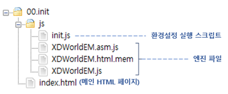
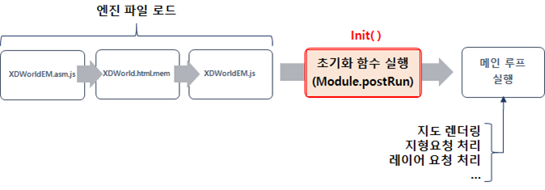
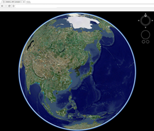

# 시작하기

엔진 파일을 받은 후 구동하기까지 과정을 자세히 소개합니다.

최신 엔진 파일은 아래 깃허브에서 다운로드 받으실 수 있습니다.



## 엔진 파일 구성

깃허브에서는 엔진 파일 / 실행 스크립트 / 기본 HTML 페이지를 함께 배포합니다.



엔진 파일은 세 가지 파일로 구성되어 있으며 다운로드 한 파일의 폴더 XDWorld-main/Release/(버전명)/js에서 찾을 수 있습니다.

엔진을 구동할 때 세 파일이 순차적으로 로드되어야 하며,

1. XDWorldEM.asm.js
2. XDWorld.html.mem
3. XDWorldEM.js

파일 순으로 로드합니다.


다음 단계에서 각 파일의 로드 과정에 대해 소개합니다.

## 엔진 파일 로드

자세한 설명에 앞서, 기본 index.html 페이지와 엔진 파일 로드를 위한 init.js 파일의 코드는 다음과 같습니다.


index.html 파일과 init.js 파일은 다운로드 엔진 다운로드 구성에 기본으로 첨부되어 있으므로 그대로 활용하실 수 있습니다.





```html
<!doctype html>
<html>
<head>
   <title>[EGIS] Init
   <style>
      #map {
         position: absolute;
         width: calc(100%);
         height: calc(100%);
         left: 0px;
         top: 0px;
      }
   </style>
</head>
<body>
   <div id="map"></div>
      <script>
         var initScript = document.createElement('script');
         initScript.src = "./js/init.js";
         document.body.appendChild(initScript);
      </script>
</body>
</html>
```







```javascript
// 엔진 로드 후 실행할 초기화 함수(Module.postRun)
function init() {
   // 엔진 초기화 API 호출(필수)
   Module.initialize({
      container: document.getElementById("map"),
      terrain: {
         dem: {
            url: "지형 DEM 데이터 요청 URL,
            name: "지형 DEM 레이어 명칭",
            servername: "요청 Server 명칭"
         },
         image: {
            url: "지형 영상 이미지 데이터 요청 URL",
            name: "지형 용상 이미지 레이어 명칭",
            servername: "요청 Server 명칭"
         },
      },
      defaultKey : "발급 API KEY"
   });
}

var Module = {
   TOTAL_MEMORY: 256*1024*1024,
   postRun: [init],
};

// 엔진 파일 로드
;(function(){
   // 1. XDWorldEM.asm.js 파일 로드
   var file = "./js/XDWorldEM.asm.js";

   var xhr = new XMLHttpRequest();
   xhr.open('GET', file, true);
   xhr.onload = function() {

      var script = document.createElement('script');
      script.innerHTML = xhr.responseText;
      document.body.appendChild(script);

      // 2. XDWorldEM.html.mem 파일 로드
      setTimeout(function() {
         (function() {
            var memoryInitializer = "./js/XDWorldEM.html.mem";
            var xhr = Module['memoryInitializerRequest'] = new XMLHttpRequest();
            xhr.open('GET', memoryInitializer, true);
               xhr.responseType = 'arraybuffer';
               xhr.onload =  function(){

                  // 3. XDWorldEM.js 파일 로드
                  var url = "./js/XDWorldEM.js";
                  var xhr = new XMLHttpRequest();
                  xhr.open('GET',url , true);
                  xhr.onload = function(){
                     var script = document.createElement('script');
                     script.innerHTML = xhr.responseText;
                     document.body.appendChild(script);
                  };
                  xhr.send(null);
               }
               xhr.send(null);
            })();
         }, 1);
      };
      xhr.send(null);
   }
)();
```




### index.html

index.html 파일에서는 엔진 로드를 위한 init.js 를 호출합니다.

```html
<script>
    var initScript = document.createElement("script");
    initScript.src = "./js/init.js";
    document.body.appendChild(initScript);
</script>
<div id="map"></div>
```

"map" element는 canvas, HTMLObject를 담는 container가 동적으로 추가 됩니다.

index.html 에서 필요에 따라 인터페이스를 추가할 수 있습니다.


지도 위에 인터페이스를 오버랩 하는 경우 canvas가 인터페이스 아래에 위치할 수 있도록 z-index값이 적절히 조정되어야 합니다.



위 index.html 코드에서는 init.js 를 호출 할 때 지도를 렌더링 할 canvas를 생성하지만, html 페이지에서 미리 canvas를 생성 한 후 생성한 canvas와 엔진 모듈을 연결 할 수도 있습니다.

엔진 모듈과 canvas 연결은 [지도 모듈 객체 선언](start.md#undefined-4) 항목을 참조해 주십시오.


### init.js

init.js 의 코드는

-   엔진 초기화 함수 선언 부분
-   지도 모듈 객체 선언 부분
-   엔진 파일 로드 부분

으로 구성되어 있습니다.

#### 지도 모듈 객체 선언

엔진 API 호출을 위한 모듈 객체를 선언합니다.

```javascript
var Module = {
    TOTAL_MEMORY: 256 * 1024 * 1024,
    postRun: [init],
};
```

반드시 객체 이름은 Module 로 선언해주어야 하며 postRun 속성은 필수로 입력되어야 합니다.

-   postRun : 엔진 모듈이 준비 된 시점에서 호출되는 함수를 지정합니다.

#### 엔진 초기화 함수 선언

엔진 파일이 모두 완료 된 시점에 처음으로 호출되는 함수를 선언합니다.

선언 된 함수는 Module 객체의 postRun 속성으로 지정합니다.

initialize를 구성하는 "container" property로 지정된 element 내부에 canvas를 동적으로 생성합니다.

```javascript
// 엔진 로드 후 실행할 초기화 함수(Module.postRun)
function init() {
    // 엔진 초기화 API 호출(필수)
    Module.initialize({
        container: document.getElementById("map"),
        defaultKey: "발급 API KEY",
    });
}
```

#### 엔진 파일 로드

엔진 파일을 순서대로 로드합니다. 파일 로드 순서에 유의하십시오.

```javascript
// 엔진 파일 로드
(function () {
    // 1. XDWorldEM.asm.js 파일 로드
    var file = "./js/XDWorldEM.asm.js";

    var xhr = new XMLHttpRequest();
    xhr.open("GET", file, true);
    xhr.onload = function () {
        var script = document.createElement("script");
        script.innerHTML = xhr.responseText;
        document.body.appendChild(script);

        // 2. XDWorldEM.html.mem 파일 로드
        setTimeout(function () {
            (function () {
                var memoryInitializer = "./js/XDWorldEM.html.mem";
                var xhr = (Module["memoryInitializerRequest"] = new XMLHttpRequest());
                xhr.open("GET", memoryInitializer, true);
                xhr.responseType = "arraybuffer";
                xhr.onload = function () {
                    // 3. XDWorldEM.js 파일 로드
                    var url = "./js/XDWorldEM.js";
                    var xhr = new XMLHttpRequest();
                    xhr.open("GET", url, true);
                    xhr.onload = function () {
                        var script = document.createElement("script");
                        script.innerHTML = xhr.responseText;
                        document.body.appendChild(script);
                    };
                    xhr.send(null);
                };
                xhr.send(null);
            })();
        }, 1);
    };
    xhr.send(null);
})();
```

## 엔진 실행

Module의 postRun 함수로 지정한 init 함수에서 Module.Start API를 실행하면 엔진 렌더링이 시작됩니다



엔진 렌더링이 시작되면 초기 화면으로 지구본 화면이 출력됩니다.



##

XDWorld를 사용한 다양한 <mark style="color:red;">샘플코드</mark>를 살펴보고 싶으시다면? [여기](http://sandbox.dtwincloud.com/code/main.do?id=start)를 클릭해 주세요.

XDWorld에 대해 <mark style="color:red;">질문 사항</mark>이 있다면? [여기](https://github.com/EgisCorp/XDWorld/issues)를 클릭해 주세요.

XDWorld를 사용한 차세대 <mark style="color:red;">디지털트윈 클라우드</mark> 서비스를 살펴보고 싶으시다면? [여기](https://www.dtwincloud.com)를 클릭해 주세요.
