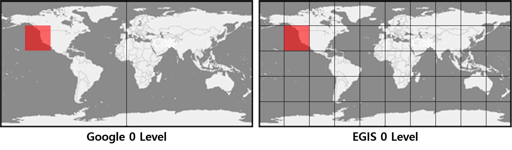

# JSImageryProvider

> Module.[Type](jsImageryProvider.md#type)() API를 생성합니다.

```javascript
var google = Module.GoogleMap();    ( supports: normal, terrain, vectorhybrid, satellitehybrid, satellite )
var osm = Module.OpenStreetMap();   ( supports: normal )
var arc = Module.ArcMap();          ( supports: normal, terrain, vectorhybrid, satellite )
var mapbox = Module.MapBox();       ( supports: normal, satellite )
var wmts = Module.WMTS();
```

## Properties

| Name                                        | Type                                      | Description                     	|
| ------------------------------------------- | ----------------------------------------- | ----------------------------------- |
| [layername](jsImageryProvider.md#layername) | string                                    | 배경 영상 지도 레이어명.          			|
| provider                                    | [Provider](jsImageryProvider.md#provider) | 배경 영상 지도 타일링 정보설정.   				|
| layerName                                   | string                                    | 배경 영상 지도 레이어명.         			|
| quality                                     | [Quality](jsImageryProvider.md#quality)   | 배경 영상 지도 이미지 품질.       			|
| zeroLevel                                   | number									  | 서로 다른 타일구조의 매칭을 위한 보간 값(높은값일 수록 요청수가 많아진다).        			|
| zerolevelOffset                             | string                                    | 배경 영상 지도 이미지 LOD offset. 			|
| maxLevel                                    | number                                    | 배경 영상 지도 최대 레벨.         			|
| minLevel                                    | number                                    | 배경 영상 지도 최소 레벨.         			|
| crackValue                                  | number                                    | 크랙발생시 보간값(보간값 만큼 이미지를 더 생성한다).         			|
| apikey                                      | string                                    | 배경 영상 지도 apikey.         			|
	
## Function

### clear()

> 배경 영상을 초기화 합니다.




-   Sample
    -   function clearMap 참조.
    -   [Sandbox_Base Map Setting](https://sandbox.egiscloud.com/code/main.do?id=layer_basemap)
    -   [Sandbox_WMTS](https://sandbox.egiscloud.com/code/main.do?id=layer_wmts)




```javascript
Module.GoogleMap().clear();
Module.OpenStreetMap().clear();
Module.ArcMap().clear();
Module.MapBox().clear();
Module.WMTS().clear();
```




### refresh()

> 배경 영상을 새로 고침 합니다.







```javascript
Module.GoogleMap().refresh();
Module.OpenStreetMap().refresh();
Module.ArcMap().refresh();
Module.MapBox().refresh();
Module.WMTS().refresh();
```




### setblank()

> 배경 영상에서 빈 타일 공백 이미지를 설정합니다.
>
> 256 \* 256 검은색 이미지로 지정합니다.
>
> 적용 후 refresh() 실행해 주시기 바랍니다.







```javascript
Module.GoogleMap().setblank();
Module.OpenStreetMap().setblank();
Module.ArcMap().setblank();
Module.MapBox().setblank();
Module.WMTS().setblank();
```




### Type Definitions

#### Type

> 배경 영상 지도 서버 옵션.

| Name            | Type   | Description                                                |
| --------------- | ------ | ---------------------------------------------------------- |
| GoogleMap()     | object | Google Map 배경 영상 지도 설정.                            |
| OpenStreetMap() | object | OpenStreet Map 배경 영상 지도 설정.                        |
| ArcMap()        | object | ArcMap Map 배경 영상 지도 설정.                            |
| MapBox()        | object | MapBox Map 배경 영상 지도 설정.                            |
| WMTS()          | object | WMTS(웹 맵 타일 서비스) 표준 프로토콜 배경 영상 지도 설정. |

#### LayerName

> 배경 영상 지도 레이어 정보.

| Name            | Type   | Description           |
| --------------- | ------ | --------------------- |
| normal          | string | 일반 지도.            |
| terrain         | string | 등고선 지도.          |
| vectorhybrid    | string | 벡터 하이브리드 지도. |
| satellitehybrid | string | 영상 하이브리드 지도. |
| satellite       | string | 영상 지도.            |
| cadastral       | string | 지적편집도.           |

#### Provider

> 배경 영상 지도 설정.

| Name          | Type                                             | Attributes | Default       | Description                                      |
| ------------- | ------------------------------------------------ | ---------- | ------------- | ------------------------------------------------ |
| url           | string                                           |            |               | 요청 서버 URL 구성요소.                          |
| tileExtent    | [Rect2D](../etc/tag-list.md#rect2d-style-type)   |            |               | 지도 타일링 영역 설정(좌하단, 우상단).           |
| gridSubset    | [Rect2D](../etc/tag-list.md#rect2d-style-type)   |            |               | 데이터 최소/최대 영역 설정(좌하단, 우상단).      |
| projection    | string                                           |            |               | 지도 원본 EPSG 코드.                             |
| resolutions   | array(number)                                    |            |               | 타일링 해상도.                                   |
| matrixIds     | array(number)                                    |            |               | 타일링 레벨(해상도와 매칭).                      |
| tileSize      | number                                           | optional   | 256           | 타일에 가시화 이미지 사이즈 설정.                |
| serviceLevel  | [Range2D](../etc/tag-list.md#range2d-style-type) | optional   | min=0, max=18 | 최소, 최대 이미지 가시화 레벨 설정.              |
| vworldTileSet | boolean                                          | optional   | false         | 브이월드 타일구조로 타일링일 경우(true).         |
| indexOrder    | boolean                                          | optional   | true          | 타일 인덱싱 기준점(false: 좌하단, true: 좌상단). |
| boxRequest    | boolean                                          | optional   | false         | 인덱싱이 아닌 박스단위 요청일 경우(true).        |
| iscrack    	| boolean                                          | optional   | false         | 타일링시 크랙이 발생 할 경우(true).        |
| crackvalue    | number                                           | optional   | 1000          | 크랙발생시 보간값(보간값 만큼 이미지를 더 생성한다).        |

#### Quality

> 배경 영상 지도 해상도.

| Value 		| Type                | Description       |
| ------------- | ------------------- | ----------------  |
| low           | string              | 256 x 256 해상도   |
| middle    	| string              | 512 x 512 해상도   |
| high    		| string              | 1024 x 1024 해상도   |

#### ZeroLevel



> 예를들어 EGIS Tile 구조와 다른 Google 이미지를 사용할 경우 Tile이 서로 1:1 매칭되지 않는다. 
> 그렇기 때문에 EGIS Tile에 걸치는 Google Tile을 모두 요청하여 EGIS Tile에 맞게 이미지를 자른다.
> 이 과정에서 동일한 레벨의 Google Tile 1개로 EGIS Tile 1개를 만들때 이미지 해상도 차이가 발생한다.
> 이것을 해결하기 위해 zeroLevel 변수를 활용하여 EGIS의 실제 Tile 레벨 보다 높은 레벨(EGIS 레벨 + zeroLevel)의 Google Tile 이미지를 요청한다.
