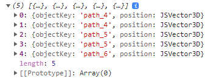

# 1.6x 버전 업데이트

## - API 변경 내용 -

### 추가 Class

-   JSProj : EPSG를 이용한 좌표 변환 기능 추가.
-   [JSProj ](../etc/jsproj.md)메뉴얼 참조

### 추가 API

**JSVec3Array 내 좌표들 중 같은 지점 값을 가진 중복점을 제거하는 API**

```javascript
var list = new Module.JSVec3Array();
list.push(new Module.JSVector3D(129.128265, 35.171834, 1000));
list.push(new Module.JSVector3D(129.128845, 35.171145, 1000));
list.push(new Module.JSVector3D(129.128845, 35.171145, 1000)); // 중복점
list.push(new Module.JSVector3D(129.128951, 35.170951, 1000));

var removed_count = list.removeDuplicateVectors(Number.EPSILON);
```

**고스트 심볼 조명 색상 변경 API**

```javascript
let object = Module.createGhostSymbol("오브젝트 명칭");
// 생성 정보 코드
object.lightColor = new Module.JSColor(255, 128, 128, 128);
```

**JSPipe 오브젝트를 담는 파이프 레이어(ELT_PIPE) 의 수직 단면 교차점 반환 API**

-   class : JSLayer
-   parameter : 교차점을 계산하고자 하는 수직 평면 경로(입력 타입 JSVec2Array)
-   return : 위치(경도, 위도, 고도)와 교차점이 발생한 파이프의 오브젝트 키 리스트를 배열로 반환 

```javascript
var path = new Module.JSVec2Array();
path.push(new Module.JSVector2D(126.92326703887365, 37.5249592425154));
path.push(new Module.JSVector2D(126.923563634119, 37.524387028175454));
path.push(new Module.JSVector2D(126.92490490575213, 37.52439598531512));

var intersection = pipeLayer.getPipeIntersection(path);
console.log(intersection);
```

**JSSolarManager API 업데이트**

-   getLayerPannelInfo
-   addPlannelObject

**JSCamera API(Property) 업데이트**

-   collision_type(type boolean) : 휠 이벤트에서 카메라와 선택지점 충돌 유무를 설정합니다.
-   collision_distance(type number) : 휠 이벤트에서 카메라와 선택지점(마우스 이벤트 지점) 보간 거리를 설정합니다.

```javascript
var camera = Module.getViewCamera();
camera.collision_type = true;
camera.collision_distance = 20;
```

### 개선 API

**브이월드 요청 URL 변경에 따른 API 사용방법**

```javascript
// 지도 초기화 생성 방법
Module.initialize({
    container: document.getElementById("map"),
    terrain: {
        dem: {
            url: "http://xdworld.vworld.kr:8080",
            name: "dem",
            servername: "XDServer3d", // 요청 서버 이름
            encoding: true, // DEM 복호화
        },
        image: {
            url: "http://xdworld.vworld.kr:8080",
            name: "tile_mo_HD",
            servername: "XDServer3d", // 요청 서버 이름
        },
    },
    defaultKey: "인증키 입력",
});
// TileLayer 생성 방법
// JSLayerList의 createXDServerLayer API에 servername 옵션이 추가되었습니다. 변경된 서버 네임을 이곳에서 설정하시면 됩니다.
var layer = Module.getTileLayerList().createXDServerLayer({
    url: "http://xdworld.vworld.kr:8080",
    servername: "XDServer3d", // 요청 서버 이름
    name: "facility_build",
    type: 9,
    minLevel: 0,
    maxLevel: 15,
});
```

**JSColorPolygon 생성 기능 개선**

```javascript
var polygon = Module.createColorPolygon("GRADATION_POLYGON");
polygon.set({
    vertex: [new Module.JSVector3D(129.12909050967076, 35.17110889362373, 4.22), new Module.JSVector3D(129.130474460754, 35.17110084682464, 4.0), new Module.JSVector3D(129.13056137846394, 35.17032570132414, 4.07), new Module.JSVector3D(129.12921614563658, 35.17031032880493, 4.39)],
    color: [new Module.JSColor("#FF0000"), new Module.JSColor("#FF0000"), new Module.JSColor("#FFFF00"), new Module.JSColor("#FFFF00")],
    index: [0, 1, 2, 0, 2, 3],
});
```

**JSLineString 생성 기능 개선**

```javascript
var line = Module.createLineString("GRADATION_LINE");
line.createbyJson({
    coordinates: {
        style: "XYZ",
        coordinate: [
            [129.12486405043842, 35.17410008274932, 5.7],
            [129.12522538156702, 35.17364593649981, 5.6],
            [129.12563286539853, 35.17332821268188, 5.6],
        ],
    },
    type: 0,
    color: [
        { a: 255, r: 255, g: 0, b: 0 },
        { a: 255, r: 255, g: 127, b: 0 },
        { a: 255, r: 255, g: 255, b: 0 },
    ],
    width: 10.0,
});
```

### 샌드박스 업데이트

-   [폴리곤 그라데이션](https://sandbox.dtwincloud.com/code/main.do?id=object_colorpolygon_color_gradation)에서 기능의 동작을 확인하실 수 있습니다.

## - 업데이트 내역 -

### 1.60.0 / beta 2.2.0 (2024/3/29)

#### 1. 건물을 통과하여 직선거리를 분석하는 API 추가
  * 시작점과 끝점의 높이/거리/(오브젝트를 통과하여)직선거리를 측정하는 <측량> 기능이 추가되었습니다.
  * `JSOption`에 해당 기능의 콜백 함수를 등록할 수 있는 `callBackAltDistance()` API가 추가되었습니다. 
    * [샌드박스 링크](https://sandbox.egiscloud.com/code/main.do?id=analysis_measure_altdistance)
  * 마우스 모드에 `MML_ANALYS_ALTDISTANCE`가 추가되었습니다.

### 1.60.0 / beta 2.2.0 (2024/3/29)

#### 1. Added API for analyzing straight-line distance passing through buildings
  * The <Measurement> feature has been added to measure the height/distance/straight distance(passing through objects) between the starting point and the ending point.
  * Added `callBackAltDistance()` API to `JSOption` for registering callback functions for this feature.
    * [sandbox link](https://sandbox.egiscloud.com/code/main.do?id=analysis_measure_altdistance)
  * Added MML_ANALYS_ALTDISTANCE to mouse modes.
