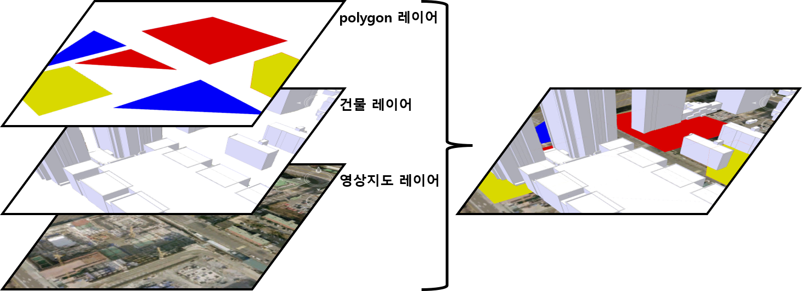

# 레이어 설정

레이어 가시설정.



## Layername

> 배경 영상 지도 레이어명.

| Name            | Type   | Attributes | Default | Description                           |
| --------------- | ------ | ---------- | ------- | ------------------------------------- |
| nomal      	  | string |            |         | 일반 지도.                |
| terrain         | string |            |         | 지형 등고선 지도.                 |
| vectorhybrid    | string |            |         | 벡터 하이브리드 지도.               |
| satellitehybrid | string |            |         | 영상 하이브리드 지도.                 |
| satellite 	  | string |            |         | 영상 지도.           |

```javascript
var naver = Module.NaverMap();
naver.layername = "satellite";

var daum = Module.DaumMap();
naver.layername = "satellite";

var google = Module.GoogleMap();
naver.layername = "satellitehybrid";

var bing = Module.BingMap();
naver.layername = "satellitehybrid";

var osm = Module.OpenStreetMap();
naver.layername = "nomal";

var arc = Module.ArcMap();
naver.layername = "vectorhybrid";

var mapbox = Module.MapBox();
naver.layername = "satellite";

var skymap = Module.SKYMap();
naver.layername = "2020";
```