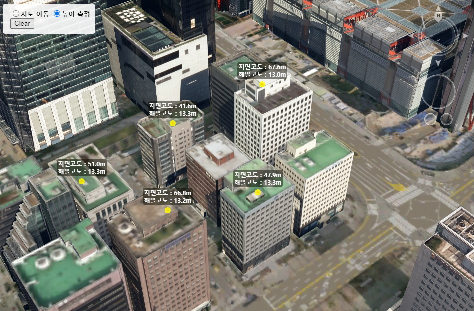

# 높이 측정


본 페이지에서는 지도의 마우스 모드를 높이 측정 모드로 변경한 후 클릭한 지점의 측정 결과를 POI로 가시화 하는 과정에 대하여 알아봅니다.

#### 해발고도와 상대고도

높이는 기준점에 따라 해발고도, 상대고도 값이 주로 쓰입니다.


* 해발고도 : 해수면을 기준으로 측정한 높이
* 지면고도 : 지면을 기준으로 측정한 높이

본 샘플 코드에서는 지면을 클릭한 경우 해발고도 값을, 건물이나 기타 시설물을 클릭한 해발고도 값과 지고도 값을 함께 표시하도록 구성하였습니다.


<details>

<summary>위 기능을 구현하는 전체 코드입니다.</summary>

```javascript
//* 엔진 로드 후 실행할 초기화 함수(Module.postRun) */
function init() {

    // 엔진 초기화 API 호출(필수)
    Module.Start(window.innerWidth, window.innerHeight);

    // 카메라 위치 설정
    Module.getViewCamera().setLocation(new Module.JSVector3D(126.92836647767662, 37.52439503321471, 1000.0));

    // 아이콘 관리 심볼 생성
    GLOBAL.Symbol = Module.getSymbol();

    // 분석 출력 POI 레이어 생성
    var layerList = new Module.JSLayerList(true);
    GLOBAL.Layer = layerList.createLayer("MEASURE_POI", Module.ELT_3DPOINT);
    GLOBAL.Layer.setMaxDistance(20000.0);
    GLOBAL.Layer.setSelectable(false);
	
    Module.XDEMapCreateLayer("facility_build", "http://xdworld.vworld.kr:8080", 8080, true, true, false, 9, 0, 15);
	
    initEvent(Module.canvas);
}

var GLOBAL = {
    Symbol : null,		// 아이콘 관리 심볼 객체
    Layer : null,		// POI 저장 레이어
    nIndex : 0			// POI, Icon 생성 인덱스
};

/* 이벤트 설정 */
function initEvent(canvas) {

    // 거리측정 이벤트 설정
    canvas.addEventListener("Fire_EventAddAltitudePoint", function(e){
        createPOI(
            new Module.JSVector3D(e.dLon, e.dLat, e.dAlt),
	    "rgba(10, 10, 0, 0.5)",
            e.dGroundAltitude, e.dObjectAltitude
        );
    });
}

/* 마우스 상태 변경 */
function setMouseState(_option){

    // 마우스 모드 설정
    Module.XDSetMouseState(_option);
}

/* 분석 내용 출력 POI 생성 */
function createPOI(_position, _color, _value, _subValue) {

    // POI 아이콘 이미지를 그릴 Canvas 생성
    var drawCanvas = document.createElement('canvas');
    drawCanvas.width = 200;
    drawCanvas.height = 100;

    // 아이콘 이미지 데이터 반환
    var imageData = drawIcon(drawCanvas, _color, _value, _subValue),
	nIndex = GLOBAL.nIndex
        ;

    // 심볼에 아이콘 이미지 등록
    if (GLOBAL.Symbol.insertIcon("Icon"+nIndex, imageData, drawCanvas.width, drawCanvas.height)) {

        // 등록한 아이콘 객체 반환
        var icon = GLOBAL.Symbol.getIcon("Icon"+nIndex);

        // JSPoint 객체 생성
        var count = GLOBAL.Layer.getObjectCount(),
            poi = Module.createPoint("POI"+nIndex)
            ;

        poi.setPosition(_position); // 위치 설정
        poi.setIcon(icon); // 아이콘 설정

        // 레이어에 오브젝트 추가
        GLOBAL.Layer.addObject(poi, 0);

        // 인덱스 값 상승
        GLOBAL.nIndex++;
    }
}

/* 아이콘 이미지 데이터 반환 */
function drawIcon(_canvas, _color, _value, _subValue) {

    // 컨텍스트 반환 및 배경 초기화
    var ctx = _canvas.getContext('2d'),
        width = _canvas.width,
        height = _canvas.height
        ;
    ctx.clearRect(0, 0, width, height);

    // 배경과 높이 값 텍스트 그리기
    if (_subValue == -1) {
        drawRoundRect(ctx, 50, 20, 100, 20, 5, _color);		// 오브젝트 높이 값이 유효하지 않는 경우
    } else {
        drawRoundRect(ctx, 50, 5, 100, 35, 5, _color);		// 오브젝트 높이 값이 유효한 경우
        setText(ctx, width*0.5, height*0.2, '지면고도 : ' + setKilloUnit(_subValue, 0.001, 0));
    }
    setText(ctx, width*0.5, height*0.2+15, '해발고도 : '+ setKilloUnit(_value, 0.001, 0));

    // 위치 표시 점 그리기
    drawDot(ctx, width, height);

    return ctx.getImageData(0, 0, _canvas.width, _canvas.height).data;
}

/* 위치 표시 점 그리기 */
function drawDot(ctx, width, height) {

    ctx.beginPath();
    ctx.lineWidth = 6;
    ctx.arc(width*0.5, height*0.5, 2, 0, 2*Math.PI, false);
    ctx.closePath();

    ctx.fillStyle = 'rgba(255, 0, 0, 0.8)';
    ctx.fill();
    ctx.lineWidth = 8;
    ctx.strokeStyle = "rgba(255, 255, 0, 0.8)";
    ctx.stroke();
}

/* 둥근 사각형 배경 그리기 */
function drawRoundRect(ctx, x, y, width, height, radius, color) {

    if (width < 2 * radius) {
        radius = width * 0.5;
    }
    if (height < 2 * radius) {
        radius = height * 0.5;
    }

    ctx.beginPath();
    ctx.moveTo(x+radius, y);
    ctx.arcTo(x+width, y, x+width, y+height, radius);
    ctx.arcTo(x+width, 	y+height, x, y+height, radius);
    ctx.arcTo(x, y+height, x, y, radius);
    ctx.arcTo(x, y, x+width, y, radius);
    ctx.closePath();

    // 사각형 그리기
    ctx.fillStyle = color;
    ctx.fill();
    
    return ctx;
}

/* 텍스트 그리기 */
function setText(_ctx, _posX, _posY, _strText) {

    _ctx.font = "bold 12px sans-serif";
    _ctx.textAlign = "center";

    _ctx.fillStyle = "rgb(255, 255, 255)";
    _ctx.fillText(_strText, _posX, _posY);
}

/* m/km 텍스트 변환 */
function setKilloUnit(_text, _meterToKilloRate, _decimalSize){

    if (_decimalSize < 0){
    	_decimalSize = 0;
    }
    if (typeof _text == "number") {
    	if (_text < 1.0/(_meterToKilloRate*Math.pow(10,_decimalSize))) {
            _text = _text.toFixed(1).toString()+'m';
	} else {
	    _text = (_text*_meterToKilloRate).toFixed(2).toString()+'㎞';
	}
    }
    return _text;
}

/* 분석 내용 초기화 */
function clearAnalysis() {

    var layer = GLOBAL.Layer,
        symbol = GLOBAL.Symbol;
    if (layer == null) {
    	return;
    }

    // 등록된 아이콘 리스트 삭제
    var i, len, icon, poi;
    for (i=0, len=layer.getObjectCount(); i<len; i++) {

    	poi = layer.keyAtObject("POI"+i);
    	icon = poi.getIcon();

	// 아이콘을 참조 중인 POI 삭제
	layer.removeAtKey("POI"+i);

	// 아이콘을 심볼에서 삭제
	symbol.deleteIcon(icon.getId());
    }

    // POI, Icon 키 지정 인덱스 초기화
    GLOBAL.nIndex = 0;
}
```

</details>

이어서 코드의 세부 단계에 대해 알아봅니다.



## Global 변수

기능을 구현하기 전 전역으로 사용하는 변수를 선언한 부분입니다.

```javascript
var GLOBAL = {
    Symbol : null,    // 아이콘 관리 심볼 객체
    Layer : null,     // POI 저장 레이어
    nIndex : 0        // POI, Icon 생성 인덱스
};
```

#### Symbol

이미지 텍스쳐를 저장하는 텍스쳐 맵 오브젝트를 이 곳에 저장합니다.

[JSSymbol](../object/jssymbol.md)에 대한 간략한 설명은 거리 측정 튜토리얼의 [step 5. 거리 객체 생성](tutorial\_distance.md#step-5.) 항목의 JSSymbol 설명을 참조하세요.

#### Layer

생성한 [JSPoint](../object/jspoint.md) 오브젝트를 저장할 레이어를 이 변수에 저장합니다.

레이어를 저장하는 과정은 [step 1.레이어 생성](tutorial\_altitude.md#step-1.) 단계를 참조하세요.


## 기능 구현

### step 1. 레이어 생성

높이 측정 Icon 및 높이 값을 가시화 할 레이어를 생성합니다.

레이어 타입에 대한 설명은 [여기](../etc/type-list.md)를 참조해 주십시오.

```
var layerList = new Module.JSLayerList(true);

GLOBAL.Layer = layerList.createLayer("MEASURE_POI", Module.ELT_3DPOINT);
GLOBAL.Layer.setMaxDistance(20000.0);
GLOBAL.Layer.setSelectable(false);
```


### step 2. 이벤트 등록

엔진 내부에서 계산된 높이을 반환받기 위해 이벤트를 등록합니다.

```
function initEvent(canvas) {
	canvas.addEventListener("Fire_EventAddAltitudePoint", function(e){

		createPOI( new Module.JSVector3D(e.dLon, e.dLat, e.dAlt),
				   "rgba(10, 10, 0, 0.5)",
				   e.dGroundAltitude, e.dObjectAltitude );
	});
}
```

Fire\_EventAddAltitudePoint 이벤트는 마우스 모드가 [MML\_ANALYS\_ALTITUDE](../etc/type-list.md#mouse-type-list) 일 경우 발생합니다.

마우스 모드를 설정하는 과정은 다음 단계 [step 3. 마우스모드](tutorial\_altitude.md#step-3.) 변경 항목을 참조하세요.

마우스 모드를 변경한 후 지도를 클릭하면 이벤트를 통해 높이 정보가 이벤트 파라미터로 반환 됩니다.

 (1).png>)

* dLon : 높이를 측정한 위치의 경도 값&#x20;
* dLat : 높이를 측정한 위치의 위도 값&#x20;
* dAlt : 높이를 측정한 위치의 고도 값&#x20;
* dGroundAltitude : 해발 고도 값. 지면을 클릭한 경우 dAlt 값과 동일한 값이 출력 될 것입니다.&#x20;
* dObjectAltitude : 지면고도 값

위 이벤트 정보를 토대로 createPOI 함수에서 고도 정보를 출력하는 POI 오브젝트를 생성합니다.

다음 과정은 POI 오브젝트를 생성하기 전 다양한 캔버스 그리기 함수에 대한 설명입니다.

POI 오브젝트 생성 단계를 바로 확인하시려면 [여기](tutorial\_altitude.md#step-5.)로 이동하십시오.


### step 3. 마우스모드 변경

높이 측정을 위해서 마우스 모드를 변경합니다.

마우스 모드에 대한 설명은 [여기](../etc/type-list.md)를 참조해 주십시오.

```javascript
Module.XDSetMouseState(Module.MML_ANALYS_ALTITUDE);
```

###

### step 4 - 1. 높이 Icon 생성

아래 함수는 반환 받은 높이 값을 랜더링하기 위해 Icon을 생성합니다.

함수를 실행하면 아래와 같이 이미지가 canvas에 생성될 것입니다.


```javascript
function drawIcon(_canvas, _color, _value, _subValue) {

    // 컨텍스트 반환 및 배경 초기화
    var ctx = _canvas.getContext('2d'),
        width = _canvas.width,
        height = _canvas.height
        ;
        
    ctx.clearRect(0, 0, width, height);

    // 배경과 높이 값 텍스트 그리기
    if (_subValue == -1) {
        drawRoundRect(ctx, 50, 20, 100, 20, 5, _color); // 오브젝트 높이 값이 유효하지 않는 경우
    } else {
        drawRoundRect(ctx, 50, 5, 100, 35, 5, _color); // 오브젝트 높이 값이 유효한 경우
        setText(ctx, width*0.5, height*0.2, '지면고도 : ' + setKilloUnit(_subValue, 0.001, 0));
    }
    setText(ctx, width*0.5, height*0.2+15, '해발고도 : '+ setKilloUnit(_value, 0.001, 0));

    // 위치 표시 점 그리기
    drawDot(ctx, width, height);

    return ctx.getImageData(0, 0, _canvas.width, _canvas.height).data;
}
```

맨 처음 이미지를 그릴 canvas를 생성하고, 글자를 작성할 배경을 칠한 후([step 4-3. 높이 사각형 Icon 생성](tutorial\_altitude.md#step-4-3.-icon))

반환 된 고도 값을 토대로 텍스트를 입력합니다. ([step 4-4. 높이 측정 결과 값 Icon 생성](tutorial\_altitude.md#step-4-4.-icon))

마지막으로 클릭한 지점을 표시할 수 있도록 위치 표시 점을 그립니다. ([step 4-2. 높이 Point Icon 생성](tutorial\_altitude.md#step-4-2.-point-icon))

###

### step 4 - 2. 높이 Point Icon 생성

높이 측정한 위치를 가시화 하기 위한 Point Icon을 생성합니다.

```javascript
function drawDot(ctx, width, height) {

    ctx.beginPath();
    ctx.lineWidth = 6;
    ctx.arc(width*0.5, height*0.5, 2, 0, 2*Math.PI, false);
    ctx.closePath();

    ctx.fillStyle = 'rgba(255, 0, 0, 0.8)';
    ctx.fill();
    ctx.lineWidth = 8;
    ctx.strokeStyle = "rgba(255, 255, 0, 0.8)";
    ctx.stroke();
}
```

###

### step 4 - 3. 높이 사각형 Icon 생성

반환 받은 높이 값을 가시화 할 배경으로 사각형을 그립니다.

```javascript
function drawRoundRect(ctx, x, y, width, height, radius, color) {

    if (width < 2 * radius) {
        radius = width * 0.5;
    }
    
    if (height < 2 * radius) {
        radius = height * 0.5;
    }

    ctx.beginPath();
    ctx.moveTo(x+radius, y);
    ctx.arcTo(x+width, y, x+width, y+height, radius);
    ctx.arcTo(x+width, y+height, x, y+height, radius);
    ctx.arcTo(x, y+height, x, y, radius);
    ctx.arcTo(x, y, x+width, y, radius);
    ctx.closePath();

    // 사각형 그리기
    ctx.fillStyle = color;
    ctx.fill();

    return ctx;
}
```

###

### step 4 - 4. 높이 측정 결과 값 Icon 생성

반환 받은 높이 값을 사각형 Icon에 텍스트로 작성합니다.

```javascript
function setText(_ctx, _posX, _posY, _strText) {

    _ctx.font = "bold 12px sans-serif";
    _ctx.textAlign = "center";

    _ctx.fillStyle = "rgb(255, 255, 255)";
    _ctx.fillText(_strText, _posX, _posY);
}
```

###

### step 4 - 5. 높이 측정 결과 값 m/km 텍스트로 변환

필요에 따라 반환 받은 높이 값을 m/km 텍스트로 변환합니다.

```javascript
function setKilloUnit(_text, _meterToKilloRate, _decimalSize){

    if (_decimalSize < 0){
        _decimalSize = 0;
    }
    if (typeof _text == "number") {
        if (_text < 1.0/(_meterToKilloRate*Math.pow(10,_decimalSize))) {
            _text = _text.toFixed(1).toString()+'m';
        } else {
            _text = (_text*_meterToKilloRate).toFixed(2).toString()+'㎞';
        }
    }
    return _text;
}
```

###

### step 5. 높이 객체 생성

생성한 Icon으로 객체를 만들고 레이어에 추가합니다.

```javascript
function createPOI(_position, _color, _value, _subValue) {

    // POI 아이콘 이미지를 그릴 Canvas 생성
    var drawCanvas = document.createElement('canvas');
    drawCanvas.width = 200;
    drawCanvas.height = 100;

    // 아이콘 이미지 데이터 반환
    var imageData = drawIcon(drawCanvas, _color, _value, _subValue),
        nIndex = GLOBAL.nIndex
        ;

    // 심볼에 아이콘 이미지 등록
    if (GLOBAL.Symbol.insertIcon("Icon"+nIndex, imageData, drawCanvas.width, drawCanvas.height)) {

        // 등록한 아이콘 객체 반환
        var icon = GLOBAL.Symbol.getIcon("Icon"+nIndex);

        // JSPoint 객체 생성
        var count = GLOBAL.Layer.getObjectCount(),
            poi = Module.createPoint("POI"+nIndex)
	    ;

        poi.setPosition(_position);    // 위치 설정
        poi.setIcon(icon);             // 아이콘 설정

        // 레이어에 오브젝트 추가
        GLOBAL.Layer.addObject(poi, 0);

        // 인덱스 값 상승
        GLOBAL.nIndex++;
    }
}
```


### step 6. 높이 측정 초기화

높이 측정 결과 및 객체를 초기화합니다.

```javascript
function clearAnalysis() {

    var layer = GLOBAL.Layer,
        symbol = GLOBAL.Symbol;
        
    if (layer == null) {
        return;
    }

    // 등록된 아이콘 리스트 삭제
    var i, len, icon, poi;
    for (i=0, len=layer.getObjectCount(); i<len; i++) {

        poi = layer.keyAtObject("POI"+i);
        icon = poi.getIcon();

        // 아이콘을 참조 중인 POI 삭제
        layer.removeAtKey("POI"+i);

        // 아이콘을 심볼에서 삭제
        symbol.deleteIcon(icon.getId());
    }

    // POI, Icon 키 지정 인덱스 초기화
    GLOBAL.nIndex = 0;
}
```

## 결과 화면

위 과정을 모두 거치면 클릭한 지점에 높이 정보를 표시하는 측정 기능이 완성됩니다.


높이 측정 과정에 대한 라이브 코드를 확인해 보고 싶으시다면? [여기](http://sandbox.dtwincloud.com/code/main.do?id=analysis\_measure\_altitude)를 클릭해 주세요
