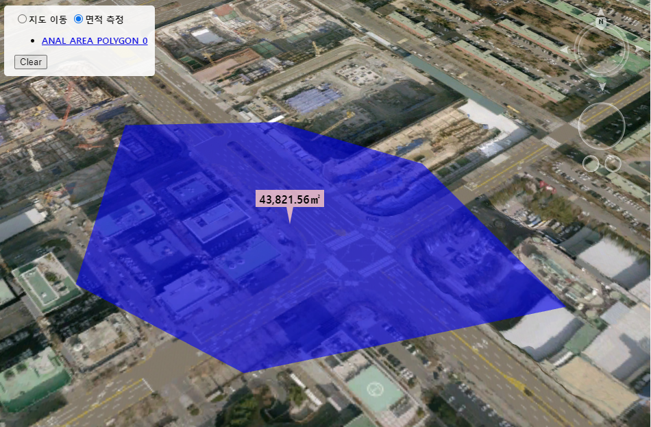

# 면적 측정하기

마우스 모드를 면적측정 모드로 변경한 후 선택한 영역의 면적를 측정합니다. 측정결과값을 이벤트로 반환받아 POI, Polygon으로 가시화합니다.



## Global 변수
```
var GLOBAL = {
	m_mercount : 0		// 측정 오브젝트 갯수
};
```

## step 1. 레이어 생성

면적측정 Icon 및 면적값을 가시화할 레이어를 생성합니다.

레이어 타입에 대한 설명은 [여기](../etc/type-list.md)를 참조해 주십시오.

```
let layerList = new Module.JSLayerList(true);
let layer = layerList.createLayer("MEASURE_POI", Module.ELT_3DPOINT);
layer.setMaxDistance(20000.0);
layer.setSelectable(false);
```

## step 2 - 1. CallBack 함수 설정

엔진 내부에서 계산된 면적을 반환받기 위해 CallBack 함수를 등록합니다.

```
Module.getOption().callBackAddPoint(addPoint);		// 마우스 입력시 발생하는 콜백 성공 시 success 반환 실패 시 실패 오류 반환
Module.getOption().callBackCompletePoint(endPoint);	// 측정 종료(더블클릭) 시 발생하는 콜백 성공 시 success 반환 실패 시 실패 오류 반환
```

## step 2 - 2. 면적측정 CallBack 함수 생성

마우스 왼쪽 클릭 시 실행되는 CallBack함수입니다. 엔진 내부에서 계산된 면적을 반환받아 가시화합니다.

```
function addPoint(e) {
	// e 구성요소
	// dLon, dLat, dAlt : 면적 중심 좌표(경위 고도)
	// dArea			: 면적 크기	
	createPOI(new Module.JSVector3D(e.dLon, e.dLat, e.dAlt), "rgba(255, 204, 198, 0.8)", e.dArea);
}
```

## step 2 - 3. 면적측정 종료 CallBack 함수 생성

마우스 더블 클릭 시 실행되는 CallBack함수입니다. 면적측정을 종료합니다.

```
function endPoint(e) {
	viewListOBjKey(e);
	GLOBAL.m_mercount++;
}
```

## step 3. 마우스모드 변경

면적측정을 위해서 마우스 모드를 변경합니다.

마우스 모드에 대한 설명은 [여기](../etc/type-list.md)를 참조해 주십시오.

```javascript
Module.XDSetMouseState(Module.MML_ANALYS_AREA_PLANE);
```

## step 4 - 1. 면적 Icon 생성

반환 받은 면적값을 랜더링하기 위해 Icon을 생성합니다.

```
function drawIcon(_canvas, _color, _value) {

	// 컨텍스트 반환 및 배경 초기화
	var ctx = _canvas.getContext('2d'),
		width = _canvas.width,
		height = _canvas.height
		;
	ctx.clearRect(0, 0, width, height);

	// 배경 Draw Path 설정 후 텍스트 그리기
	drawBalloon(ctx, height * 0.5, width, height, 5, height * 0.25, _color);
	setText(ctx, width * 0.5, height * 0.2, _value);

	return ctx.getImageData(0, 0, _canvas.width, _canvas.height).data;
}
```

## step 4 - 2. 면적 말풍선 Icon 생성

반환 받은 면적값을 누적하여 총 면적를 말풍선 Icon에 생성합니다.

```
function drawBalloon(ctx,
	marginBottom, width, height,
	barWidth, barHeight,
	color) {

	var wCenter = width * 0.5,
		hCenter = height * 0.5;

	// 말풍선 형태의 Draw Path 설정
	ctx.beginPath();
	ctx.moveTo(0, 0);
	ctx.lineTo(0, height - barHeight - marginBottom);
	ctx.lineTo(wCenter - barWidth, height - barHeight - marginBottom);
	ctx.lineTo(wCenter, height - marginBottom);
	ctx.lineTo(wCenter + barWidth, height - barHeight - marginBottom);
	ctx.lineTo(width, height - barHeight - marginBottom);
	ctx.lineTo(width, 0);
	ctx.closePath();

	// 말풍선 그리기
	ctx.fillStyle = color;
	ctx.fill();
}
```

## step 4 - 4. 면적 측정결과값 Icon 생성

반환 받은 면적값을 말풍선 Icon에 생성합니다.

```
function setText(_ctx, _posX, _posY, _value) {

	var strText = "";

	// 텍스트 문자열 설정
	var strText = setTextComma(_value.toFixed(2)) + '㎡';

	// 텍스트 스타일 설정
	_ctx.font = "bold 16px sans-serif";
	_ctx.textAlign = "center";
	_ctx.fillStyle = "rgb(0, 0, 0)";

	// 텍스트 그리기
	_ctx.fillText(strText, _posX, _posY);
}
```

## step 4 - 5. 면적 측정결과값 제곱미터 텍스트로 변환

반환 받은 면적값을 제곱미터 텍스트로 변환합니다.

```
function setTextComma(str) {
	str = String(str);
	return str.replace(/(\d)(?=(?:\d{3})+(?!\d))/g, '$1,');
}
```

## step 5. 면적 객체 생성

생성한 Icon으로 객체를 만들고 레이어에 추가합니다.

```
function createPOI(_position, _color, _value) {
	// 매개 변수
	// _position : POI 생성 위치
	// _color : drawIcon 구성 색상
	// _value : drawIcon 표시 되는 텍스트

	// POI 아이콘 이미지를 그릴 Canvas 생성
	var drawCanvas = document.createElement('canvas');
	
	// 캔버스 사이즈(이미지 사이즈)
	drawCanvas.width = 100;
	drawCanvas.height = 100;

	// 아이콘 이미지 데이터 반환
	let imageData = drawIcon(drawCanvas, _color, _value);

	let Symbol = Module.getSymbol();

	let layerList = new Module.JSLayerList(true);
	let layer = layerList.nameAtLayer("MEASURE_POI");

	// POI가 존재 하면 삭제 후 생성
	let key = GLOBAL.m_mercount + "_POI";
	layer.removeAtKey(key);
	
	// POI 생성 과정
	poi = Module.createPoint(GLOBAL.m_mercount + "_POI");
	poi.setPosition(_position);												// 위치 설정
	poi.setImage(imageData, drawCanvas.width, drawCanvas.height);			// 아이콘 설정
	
	layer.addObject(poi, 0);												// POI 레이어 등록
}
```

## step 6. 면적측정 초기화

면적측정 결과 및 객체를 초기화합니다.

```
function clearAnalysis() {

	// 실행 중인 분석 내용 초기화
	Module.XDClearAreaMeasurement();
	GLOBAL.m_mercount = 0;
	
	// 레이어 삭제
	let layerList = new Module.JSLayerList(true);
	let layer = layerList.nameAtLayer("MEASURE_POI");
	layer.removeAll();
}
```