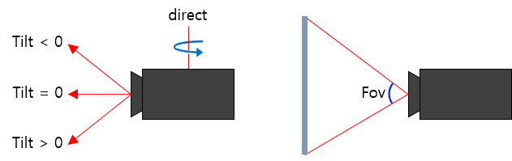

# 카메라 설정

카메라 좌우회전, 상하회전, 화각, 높이, 이동, 시점변경을 설정할 수 있습니다.

카메라 Tilt: 위, 아래 회전
카메라 Direct: 좌, 우 회전
카메라 Fov: 화각
카메라 Altitude: 고도



## 상하(Tilt) 회전

> 카메라 위,아래로 회전.
>
> * Tilt < 0 : 위로 회전.
> * Tilt = 0 : 정면.
> * Tilt > 0 : 아래로 회전.

```javascript
Module.getViewCamera().setTilt(90);	// 지형과 수직 (지형을 바라본다)
Module.getViewCamera().setTilt(0);	// 지형과 수평
Module.getViewCamera().setTilt(-90);// 지형과 수직 (지형을 등진다)
```

## 좌우(Direct) 회전

> 카메라 좌,우로 회전 (-180 ~ 180).
>
> * 0 : 북쪽.
> * -90 : 동쪽.
> * -180, 180 : 남쪽.
> * 90 : 서쪽.

```javascript
Module.getViewCamera().setDirect(0);	// 북쪽을 바라본다
Module.getViewCamera().setDirect(-90);	// 동쪽을 바라본다
Module.getViewCamera().setDirect(-180);	// 남쪽을 바라본다
Module.getViewCamera().setDirect(90);	// 서쪽을 바라본다
```

## 화각(Fov) 설정

> 카메라 화각 설정 (초기값 45).

```javascript
Module.getViewCamera().setFov(45);
```

## 높이(Altitude) 설정

> 카메라 높이 설정.

```javascript
Module.getViewCamera().setAltitude(1000);
```

## 위치 설정

> 카메라 위치 설정 (경도, 위도, 고도).

```javascript
Module.getViewCamera().setLocation(new Module.JSVector3D(127.06205102069177, 37.50848251498306, 51.0700191501528));
```

## 시점 설정

> 카메라 시점 설정.
>
> * true : 1인칭.
> * false : 3인칭.

```javascript
Module.getViewCamera().setMoveMode(true);	// 1인칭
Module.getViewCamera().setMoveMode(false);	// 3인칭
```