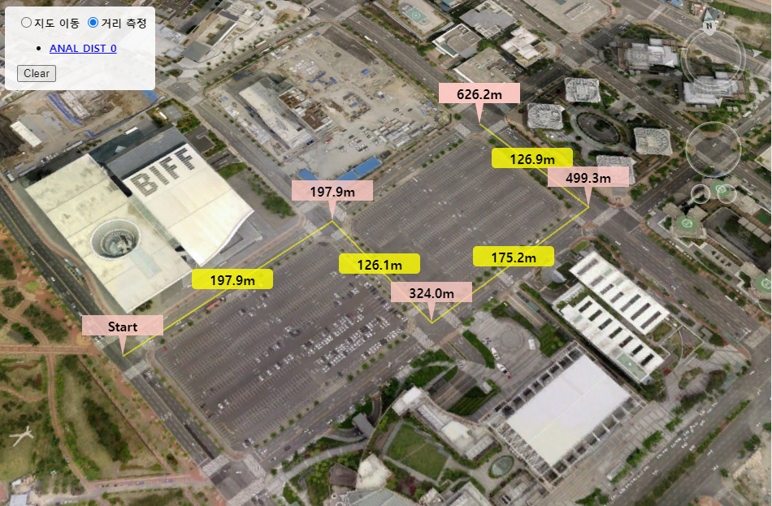

# 거리 측정

마우스 모드를 거리 측정 모드로 변경한 후 클릭 지점 사이의 거리를 측정합니다.

측정 결과 값을 이벤트로 반환 받아 POI, Line으로 가시화 합니다.




#### 기능 인터페이스

측정하고자 하는 지점을 클릭했을 경우 한 지점과 거리 값이 표시되고, 더블 클릭 했을 경우 거리 측정을 종료합니다.

거리측정 종료 후 다시 다른 지점을 클릭하면 새로운 셋의 측정 결과가 표시됩니다.

.png>)

<details>

<summary>위 기능을 구현하는 전체 코드입니다.</summary>

```javascript
function init() {

    Module.Start(window.innerWidth, window.innerHeight);

    // 카메라 위치 설정
    Module.getViewCamera().setLocation(new Module.JSVector3D(129.128265, 35.171834, 1000.0));

    // 분석 출력 POI 레이어 생성
    let layerList = new Module.JSLayerList(true);
    let layer = layerList.createLayer("MEASURE_POI", Module.ELT_3DPOINT);
    layer.setMaxDistance(20000.0);
    layer.setSelectable(false);
	
    // 거리측정 라인 랜더 옵션 설정
    Module.getOption().SetDistanceMeasureLineDepthBuffer(false); // WEBGL GL_DEPTH_TEST 설정
    
    // 콜백 함수 설정 지속적으로 사용
    Module.getOption().callBackAddPoint(addPoint); // 마우스 입력시 발생하는 콜백 성공 시 success 반환 실패 시 실패 오류 반환
    Module.getOption().callBackCompletePoint(endPoint);	// 측정 종료(더블클릭) 시 발생하는 콜백 성공 시 success 반환 실패 시 실패 오류 반환
}

/* 마우스 상태 변경 */
function setMouseState(_type){
	
    if (_type == "move") {
        // 지도 이동 마우스 모드 변경
        Module.XDSetMouseState(Module.MML_MOVE_GRAB);	
    }
    else if (_type == "measure") {
        // 거리 측정 마우스 모드 변경
        Module.XDSetMouseState(Module.MML_ANALYS_DISTANCE_STRAIGHT);
    }
}

let m_mercount = 0;	// 측정 오브젝트 갯수
let m_objcount = 0;	// 측정 오브젝트를 표시하는 POI 갯수

/* callBackAddPoint에 지정된 함수 [마우스 왼쪽 클릭 시 이벤트 발생]*/
function addPoint(e) {
    // e 구성요소
    // dMidLon, dMidLat, dMidAlt : 이전 입력 된 지점과 현재 지점을 중점(경위 고도)
    // dLon, dLat, dAlt : 현재 입력 된 지점(경위 고도)
    // dDistance		: 현재 점과 이전 점과의 길이
    // dTotalDistance	: 모든 점과의 길이
	
    let partDistance = e.dDistance,
        totalDistance = e.dTotalDistance;

    if (partDistance == 0 && totalDistance == 0) {
        m_objcount = 0;	// POI 갯수 초기화
        createPOI(new Module.JSVector3D(e.dLon, e.dLat, e.dAlt), "rgba(255, 204, 198, 0.8)", "Start", true);
    } else {
        if (e.dDistance > 0.01) {
            createPOI(new Module.JSVector3D(e.dMidLon, e.dMidLat, e.dMidAlt), "rgba(255, 255, 0, 0.8)", e.dDistance, false);
        }
        createPOI(new Module.JSVector3D(e.dLon, e.dLat, e.dAlt), "rgba(255, 204, 198, 0.8)", e.dTotalDistance, true);
    }
}

/* callBackCompletePoint에 지정된 함수 [마우스 더블 클릭 시 이벤트 발생]*/
function endPoint(e) {
    viewListOBjKey(e);
    m_mercount++;
}

// =============================================== POI 생성 과정
/* 정보 표시 POI */
function createPOI(_position, _color, _value, _balloonType) {
    // 매개 변수
    // _position : POI 생성 위치
    // _color : drawIcon 구성 색상
    // _value : drawIcon 표시 되는 텍스트
    // _balloonType : drawIcon 표시 되는 모서리 옵션(true : 각진 모서리, false : 둥근 모서리)

    // POI 아이콘 이미지를 그릴 Canvas 생성
    var drawCanvas = document.createElement('canvas');
    // 캔버스 사이즈(이미지 사이즈)
    drawCanvas.width = 100;
    drawCanvas.height = 100;

    // 아이콘 이미지 데이터 반환
    let imageData = drawIcon(drawCanvas, _color, _value, _balloonType);

    let Symbol = Module.getSymbol();

    let layerList = new Module.JSLayerList(true);
    let layer = layerList.nameAtLayer("MEASURE_POI");

    poi = Module.createPoint(m_mercount + "_POI_" + m_objcount);
    poi.setPosition(_position);												// 위치 설정
    poi.setImage(imageData, drawCanvas.width, drawCanvas.height);			// 아이콘 설정
    layer.addObject(poi, 0);												// POI 레이어 등록
    m_objcount++;
}

/* 아이콘 이미지 데이터 반환 */
function drawIcon(_canvas, _color, _value, _balloonType) {

    // 컨텍스트 반환 및 배경 초기화
    var ctx = _canvas.getContext('2d'),
        width = _canvas.width,
        height = _canvas.height
        ;
    ctx.clearRect(0, 0, width, height);

    // 배경 Draw Path 설정 후 텍스트 그리기
    if (_balloonType) {
        drawBalloon(ctx, height * 0.5, width, height, 5, height * 0.25, _color);
        setText(ctx, width * 0.5, height * 0.2, _value);
    } else {
        drawRoundRect(ctx, 0, height * 0.3, width, height * 0.25, 5, _color);
        setText(ctx, width * 0.5, height * 0.5, _value);
    }

    return ctx.getImageData(0, 0, _canvas.width, _canvas.height).data;
}

/* 말풍선 배경 그리기 */
function drawBalloon(ctx, marginBottom, width, height, barWidth, barHeight, color) {

    var wCenter = width * 0.5,
        hCenter = height * 0.5;

    // 말풍선 형태의 Draw Path 설정
    ctx.beginPath();
    ctx.moveTo(0, 0);
    ctx.lineTo(0, height - barHeight - marginBottom);
    ctx.lineTo(wCenter - barWidth, height - barHeight - marginBottom);
    ctx.lineTo(wCenter, height - marginBottom);
    ctx.lineTo(wCenter + barWidth, height - barHeight - marginBottom);
    ctx.lineTo(width, height - barHeight - marginBottom);
    ctx.lineTo(width, 0);
    ctx.closePath();

    // 말풍선 그리기
    ctx.fillStyle = color;
    ctx.fill();
}

/* 둥근 사각형 배경 그리기 */
function drawRoundRect(ctx, x, y, width, height, radius, color) {

    if (width < 2 * radius) {
        radius = width * 0.5;
    }
    
    if (height < 2 * radius) {
        radius = height * 0.5;
    }

    ctx.beginPath();
    ctx.moveTo(x + radius, y);
    ctx.arcTo(x + width, y, x + width, y + height, radius);
    ctx.arcTo(x + width, y + height, x, y + height, radius);
    ctx.arcTo(x, y + height, x, y, radius);
    ctx.arcTo(x, y, x + width, y, radius);
    ctx.closePath();

    // 사각형 그리기
    ctx.fillStyle = color;
    ctx.fill();

    return ctx;
}

/* 텍스트 그리기 */
function setText(_ctx, _posX, _posY, _value) {

    var strText = "";

    // 텍스트 문자열 설정
    if (typeof _value == 'number') {
        strText = setKilloUnit(_value, 0.001, 0);
    } else {
        strText = _value;
    }

    // 텍스트 스타일 설정
    _ctx.font = "bold 16px sans-serif";
    _ctx.textAlign = "center";
    _ctx.fillStyle = "rgb(0, 0, 0)";

    // 텍스트 그리기
    _ctx.fillText(strText, _posX, _posY);
}

/* m/km 텍스트 변환 */
function setKilloUnit(_text, _meterToKilloRate, _decimalSize) {

    if (_decimalSize < 0) {
        _decimalSize = 0;
    }
    if (typeof _text == "number") {
        if (_text < 1.0 / (_meterToKilloRate * Math.pow(10, _decimalSize))) {
            _text = _text.toFixed(1).toString() + 'm';
        } else {
            _text = (_text * _meterToKilloRate).toFixed(2).toString() + '㎞';
        }
    }
    return _text;
}

//=============================================== 측정 목록 및 삭제 관련
function viewListOBjKey(_key) {

    let cell = document.getElementById("objList");
    let li = document.createElement('li');
	
    // 측정 객체 리스트 추가( ui )
    li.id = _key
    li.innerHTML = "<a href='#' onclick=\"deleteObject('" + _key + "');\">" + _key + "</a>"
    cell.appendChild(li);
}

function deleteObject(_key) {
	
    Module.XDClearDistanceObject(_key);
    let li = document.getElementById(_key);
    li.remove();										// 선택 <a> 컨트롤러 삭제

    // 오브젝트 삭제
    let layerList = new Module.JSLayerList(true);
    let layer = layerList.nameAtLayer("MEASURE_POI");
    let list = layer.getObjectKeyList();

    let key = _key.replace(/[^0-9]/g, '') + "_POI_";	// [생성순서]_POI_ 형태로 객체 생성
    let strlist = list.split(",");
    strlist.forEach((item, index) => {
        if (item.indexOf(key) !== -1) {
            layer.removeAtKey(item)						// 키값으로 레이어에 들어간 오브젝트 삭제
        }
    });
    
    // 화면 재 갱신
    Module.XDRenderData();
}

/* 분석 내용 초기화 */
function clearAnalysis() {

    // 실행 중인 분석 내용 초기화
    Module.XDClearDistanceMeasurement();
    m_mercount = 0;
	
    // 레이어 삭제
    let layerList = new Module.JSLayerList(true);
    let layer = layerList.nameAtLayer("MEASURE_POI");
    layer.removeAll();
	
    // <ui> 모든 노드 삭제
    let cell = document.getElementById("objList");
    while ( cell.hasChildNodes() ) { 
        cell.removeChild( cell.firstChild ); 
    }
}
```

</details>

이어서 코드의 세부 단계에 대해 알아봅니다.

## 기능 구현

### Global 변수

기능을 구현하기 전 전역으로 사용하는 변수를 선언한 부분입니다.

```javascript
var GLOBAL = {
    m_objcount : 0,    // 측정 오브젝트를 표시하는 POI 갯수
    m_mercount : 0     // 측정 오브젝트 갯수
};
```

측정 종료 후 데이터를 관리할 수 있도록 오브젝트 POI 수 및 측정 오브젝트 수를 관리합니다.


### step 1. 레이어 생성

거리 측정 Icon 및 거리 값을 가시화 할 레이어를 생성합니다.

거리 측정 값을 POI로 출력해야 하므로 레이어 타입은 ELT\_3DPOINT으로 설정합니다.

레이어 타입에 대한 설명은 [여기](../etc/type-list.md)를 참조해 주십시오.

```javascript
let layerList = new Module.JSLayerList(true);
let layer = layerList.createLayer("MEASURE_POI", Module.ELT_3DPOINT);
layer.setMaxDistance(20000.0);
layer.setSelectable(false);
```


### step 2 - 1. CallBack 함수 설정

엔진 내부에서 계산된 거리를 반환 받기 위해 CallBack 함수를 등록합니다.

콜백 함수는 [JSOption](../option/jsoption.md)을 통해 등록합니다.

(자세한 API 설명은 [callBackAddPoint](../option/jsoption.md#callbackaddpoint-event-string), [callBackCompletePoint](../option/jsoption.md#callbackcompletepoint-event-string) 설명 부분을 참조하세요.)


콜백 함수는 두 가지 함수를 등록합니다.

* 측정 지점을 선택했을 때 호출되는 콜백 함수([step 2-2. 거리측정 CallBack 함수 생성](tutorial\_distance.md#step-2-2.-callback))
* 더블 클릭 하여 거리 측정 종료 시 호출되는 콜백 함수([step 2-3. 거리측정 종료 CallBack 함수 생성](tutorial\_distance.md#step-2-3.-callback))

```javascript
Module.getOption().callBackAddPoint(addPoint);	    // 마우스 입력시 발생하는 콜백 성공 시 success 반환 실패 시 실패 오류 반환
Module.getOption().callBackCompletePoint(endPoint); // 측정 종료(더블클릭) 시 발생하는 콜백 성공 시 success 반환 실패 시 실패 오류 반환
```


마우스 모드를 ELT\_3DPOINT 로 지정하였을 경우 측정하고자 하는 지점을 클릭했을 때 아래 설정한 콜백 함수가 호출됩니다.

마우스 모드 설정 부분은 [step 3. 마우스모드 변경](tutorial\_distance.md#step-3.) 항목을 참조하세요.


### step 2 - 2. 거리측정 CallBack 함수 생성

마우스 왼쪽 클릭 시 실행되는 CallBack함수입니다.

엔진 내부에서 계산된 거리를 반환 받아 가시화 합니다.

```javascript
function addPoint(e) {

    // e 구성요소
    // dMidLon, dMidLat, dMidAlt : 이전 입력 된 지점과 현재 지점을 중점(경위 고도)
    // dLon, dLat, dAlt : 현재 입력 된 지점(경위 고도)
    // dDistance		: 현재 점과 이전 점과의 길이
    // dTotalDistance	: 모든 점과의 길이
	
    let partDistance = e.dDistance,
        totalDistance = e.dTotalDistance;

    if (partDistance == 0 && totalDistance == 0) {
        GLOBAL.m_objcount = 0;	// POI 갯수 초기화
        createPOI(new Module.JSVector3D(e.dLon, e.dLat, e.dAlt), "rgba(255, 204, 198, 0.8)", "Start", true);
    } else {
        if (e.dDistance > 0.01) {
            createPOI(new Module.JSVector3D(e.dMidLon, e.dMidLat, e.dMidAlt), "rgba(255, 255, 0, 0.8)", e.dDistance, false);
        }
        createPOI(new Module.JSVector3D(e.dLon, e.dLat, e.dAlt), "rgba(255, 204, 198, 0.8)", e.dTotalDistance, true);
    }
}
```


### step 2 - 3. 거리측정 종료 CallBack 함수 생성

마우스 더블 클릭 시 실행되는 CallBack함수입니다. 거리 측정을 종료합니다.

```javascript
function endPoint(e) {
    viewListOBjKey(e);
    GLOBAL.m_mercount++;
}
```


### step 3. 마우스모드 변경

거리측정을 위해서 마우스 모드를 변경합니다.

마우스 모드에 대한 설명은 [여기](../etc/type-list.md)를 참조해 주십시오.

```javascript
Module.XDSetMouseState(Module.MML_ANALYS_DISTANCE_STRAIGHT);
```


### step 4 - 1. 거리 Icon 생성

반환 받은 거리 값을 랜더링하기 위해 이미 Icon을 생성합니다.

생성한 Icon 이미지는 이후 측정 값을 표시할 POI 오브젝트에 적용 될 것입니다.

POI 오브젝트 생성 및 결과 이미지 적용 단계는 [step 5. 거리 객체 생성](tutorial\_distance.md#step-5.) 항목을 참조하십시오.

```javascript
function drawIcon(_canvas, _color, _value, _balloonType) {

    // 컨텍스트 반환 및 배경 초기화
    var ctx = _canvas.getContext('2d'),
        width = _canvas.width,
        height = _canvas.height
        ;
        
    ctx.clearRect(0, 0, width, height);

    // 배경 Draw Path 설정 후 텍스트 그리기
    if (_balloonType) {
        drawBalloon(ctx, height * 0.5, width, height, 5, height * 0.25, _color);
        setText(ctx, width * 0.5, height * 0.2, _value);
    } else {
        drawRoundRect(ctx, 0, height * 0.3, width, height * 0.25, 5, _color);
        setText(ctx, width * 0.5, height * 0.5, _value);
    }

    return ctx.getImageData(0, 0, _canvas.width, _canvas.height).data;
}
```

측정 값의 종류에 따라 위 코드에서 생성하는 이미지의 종류는 두 가지 입니다.

#### 중간 거리 표시 Icon 이미지

.png>)

* drawRoundRect 함수([step 4-3. 거리 사각형 Icon 생성](tutorial\_distance.md#step-4-3.-icon))와 setText([step 4-4. 거리 측정 결과 값 Icon 생성](tutorial\_distance.md#step-4-4.-icon)) 함수를 조합하여 둥근 형태의 텍스트 박스 이미지를 생성합니다.

#### 누적 거리 표시 Icon 이미지

.png>)

* drawBalloon 함수([step 4-2. 거리 말풍선 Icon 생성](tutorial\_distance.md#step-4-2.-icon))와 setText([step 4-4. 거리 측정 결과 값 Icon 생성](tutorial\_distance.md#step-4-4.-icon)) 함수를 조합하여 둥근 형태의 텍스트 박스 이미지를 생성합니다.


### step 4 - 2. 거리 말풍선 Icon 생성

반환 받은 거리 값을 누적 하여 표시 할 수 있도록 누적 거리 표시 말풍선 이미지를 그립니다.

```javascript
function drawBalloon(ctx, marginBottom, width, height, barWidth, barHeight, color) {

    var wCenter = width * 0.5,
        hCenter = height * 0.5;

    // 말풍선 형태의 Draw Path 설정
    ctx.beginPath();
    ctx.moveTo(0, 0);
    ctx.lineTo(0, height - barHeight - marginBottom);
    ctx.lineTo(wCenter - barWidth, height - barHeight - marginBottom);
    ctx.lineTo(wCenter, height - marginBottom);
    ctx.lineTo(wCenter + barWidth, height - barHeight - marginBottom);
    ctx.lineTo(width, height - barHeight - marginBottom);
    ctx.lineTo(width, 0);
    ctx.closePath();

    // 말풍선 그리기
    ctx.fillStyle = color;
    ctx.fill();
}
```


### step 4 - 3. 거리 사각형 Icon 생성

반환 받은 중간 거리 값을 표시 할 수 있도록 둥근 사각 말풍선 이미지를 그립니다.

```javascript
function drawRoundRect(ctx, x, y, width, height, radius, color) {

    if (width < 2 * radius) radius = width * 0.5;
    if (height < 2 * radius) radius = height * 0.5;

    ctx.beginPath();
    ctx.moveTo(x + radius, y);
    ctx.arcTo(x + width, y, x + width, y + height, radius);
    ctx.arcTo(x + width, y + height, x, y + height, radius);
    ctx.arcTo(x, y + height, x, y, radius);
    ctx.arcTo(x, y, x + width, y, radius);
    ctx.closePath();

    // 사각형 그리기
    ctx.fillStyle = color;
    ctx.fill();

    return ctx;
}
```


### step 4 - 4. 거리 측정 결과 값 Icon 생성

그려진 말풍선 위에 반환 받은 거리 값을 텍스트로 그립니다.

```javascript
function setText(_ctx, _posX, _posY, _value) {

    var strText = "";

    // 텍스트 문자열 설정
    if (typeof _value == 'number') {
        strText = setKilloUnit(_value, 0.001, 0);
    } else {
        strText = _value;
    }

    // 텍스트 스타일 설정
    _ctx.font = "bold 16px sans-serif";
    _ctx.textAlign = "center";
    _ctx.fillStyle = "rgb(0, 0, 0)";

    // 텍스트 그리기
    _ctx.fillText(strText, _posX, _posY);
}
```


### step 4 - 5. 거리 측정 결과 값 m/km 텍스트로 변환

필요에 따라 반환 받은 거리 값을 m/km 텍스트로 변환합니다.

```javascript
function setKilloUnit(_text, _meterToKilloRate, _decimalSize) {

    if (_decimalSize < 0) {
        _decimalSize = 0;
    }
    
    if (typeof _text == "number") {
        if (_text < 1.0 / (_meterToKilloRate * Math.pow(10, _decimalSize))) {
            _text = _text.toFixed(1).toString() + 'm';
        } else {
            _text = (_text * _meterToKilloRate).toFixed(2).toString() + '㎞';
        }
    }
    return _text;
}
```


### step 5. 거리 객체 생성

생성한 Icon을 활용하여 POI 오브젝트를 만들고 레이어에 추가합니다.

이미지 활용을 위해 이전 단계에서 canvas에 그린 이미지를 [JSSymbol](../object/jssymbol.md)에 Icon으로 저장합니다.

#### JSSymbol

XDWorld에서는 텍스쳐를 저장, 관리하는 [JSSymbol](../object/jssymbol.md) 클래스가 있습니다.

Step 4 단계에서 만들어진 이미지들은 [JSSymbol](tutorial\_distance.md#jssymbol)에 저장되고 이후 새로 만들어진 POI 오브젝트와 연결될 것입니다.

.png>)

```javascript
function createPOI(_position, _color, _value, _balloonType) {

    // 매개 변수
    // _position : POI 생성 위치
    // _color : drawIcon 구성 색상
    // _value : drawIcon 표시 되는 텍스트
    // _balloonType : drawIcon 표시 되는 모서리 옵션(true : 각진 모서리, false : 둥근 모서리)

    // POI 아이콘 이미지를 그릴 Canvas 생성
    var drawCanvas = document.createElement('canvas');
	
    // 캔버스 사이즈(이미지 사이즈)
    drawCanvas.width = 100;
    drawCanvas.height = 100;

    // 아이콘 이미지 데이터 반환
    let imageData = drawIcon(drawCanvas, _color, _value, _balloonType);

    let Symbol = Module.getSymbol();

    let layerList = new Module.JSLayerList(true);
    let layer = layerList.nameAtLayer("MEASURE_POI");

    poi = Module.createPoint(GLOBAL.m_mercount + "_POI_" + GLOBAL.m_objcount);
    poi.setPosition(_position);												// 위치 설정
    poi.setImage(imageData, drawCanvas.width, drawCanvas.height);			// 아이콘 설정
    layer.addObject(poi, 0);												// POI 레이어 등록
	
    GLOBAL.m_objcount++;
}
```


JSSymbol을 사용하지 않고 간단히 이미지 데이터만을 등록하여 사용하는 방법도 있습니다.

이 과정은 [POI 생성하기](tutorial\_poi.md) 튜토리얼을 참조하세요.



### step 6. 거리측정 초기화

거리 측정 결과 및 객체를 초기화합니다.

```javascript
function clearAnalysis() {

    // 실행 중인 분석 내용 초기화
    Module.XDClearDistanceMeasurement();
    GLOBAL.m_mercount = 0;
	
    // 레이어 삭제
    let layerList = new Module.JSLayerList(true);
    let layer = layerList.nameAtLayer("MEASURE_POI");
    layer.removeAll();
}
```

## 결과 화면

위 과정을 모두 거치면 클릭한 지점의 거리 정보를 표시하는 거리 측정 기능이 완성됩니다.

.png>)

거리 측정 과정에 대한 라이브 코드를 확인해 보고 싶으시다면? [여기](http://sandbox.dtwincloud.com/code/main.do?id=analysis\_measure\_distance)를 클릭해 주세요

