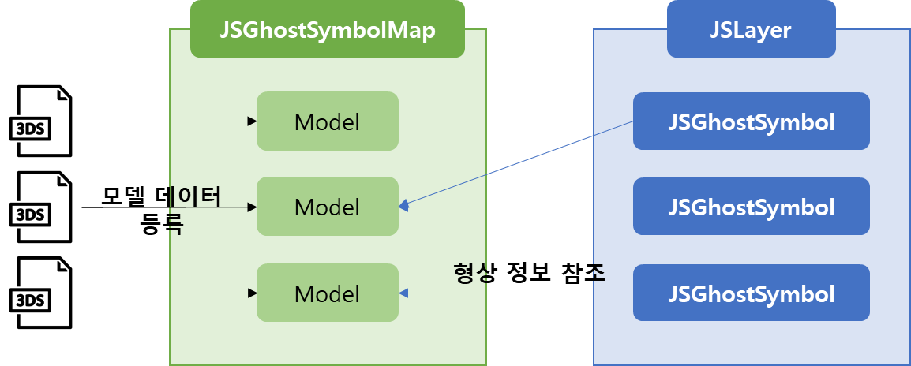
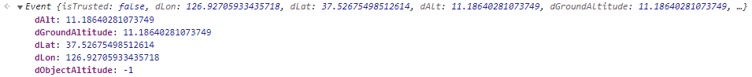
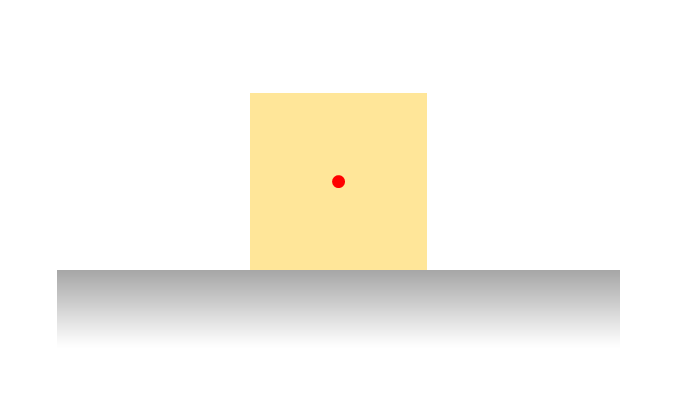
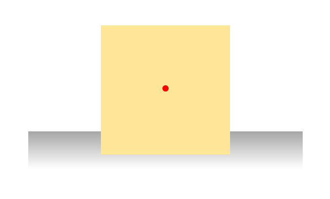
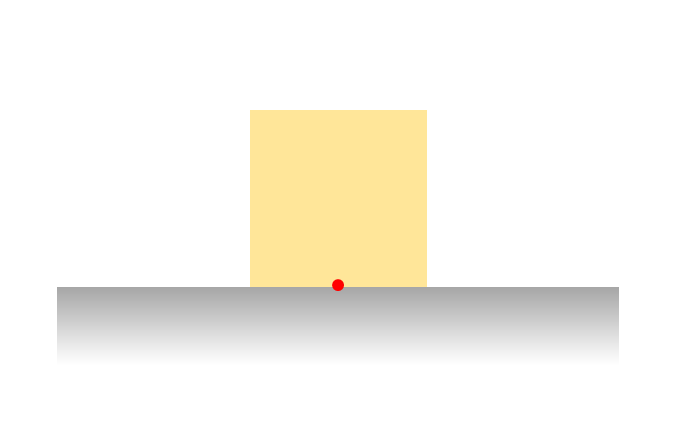
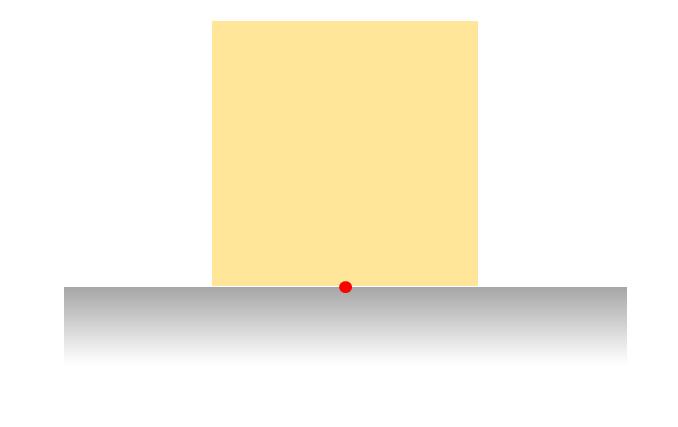
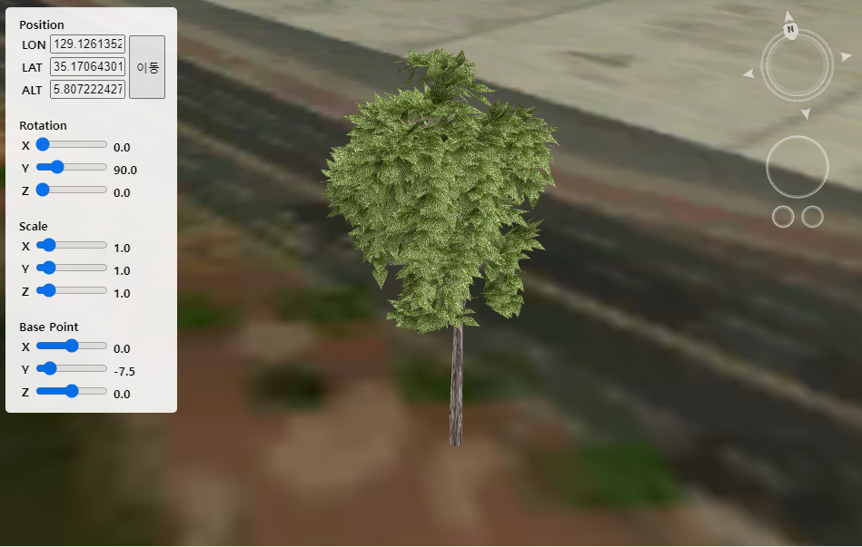

# 모델 추가하기

지도 내에 모델 파일을 로드하고 오브젝트를 생성하여 필요한 위치에 배치하는 방법에 대하여 알아봅니다.

각 모델 데이터는 [JSGhostSymbolMap](../object/jsghostsymbolmap.md) 에 저장하여 관리합니다.

저장된 모델 데이터는 [JSGhostSymbol](../object/jsghostsymbol.md) 오브젝트에서 형상 정보로 활용됩니다.

따라서 [JSGhostSymbol](../object/jsghostsymbol.md) 오브젝트를 생성하기 전에 [JSGhostSymbolMap](../object/jsghostsymbolmap.md) 에 모델 데이터가 먼저 입력 되어야 합니다.



모델 정보가 지정된 [JSGhostSymbol](../object/jsghostsymbol.md) 오브젝트는 위치, 회전, 스케일 값을 자유롭게 지정할 수 있습니다.

[JSGhostSymbol](../object/jsghostsymbol.md) 데이터는 아래 단계를 거쳐 가시화 됩니다.

1. 고스트 심볼 맵에 모델 데이터 로드
2. 모델 텍스쳐 설정 (선택)
3. 고스트 심볼 오브젝트 생성 및 설정
4. 레이어 생성 후 오브젝트 저장

아래는 [JSGhostSymbol](../object/jsghostsymbol.md) 오브젝트를 생성하는 전체 코드입니다.

```javascript
var ghostSymbolMap = Module.getGhostSymbolMap();

function createGhostSymbol() {

    // 1. 고스트 심볼 맵에 모델 데이터 로드
    ghostSymbolMap.insert({
        id : "MY_MODEL",
        url : "./data/my_model_file.3ds",
        callback : function(e) {
			
            // 2. 모델 텍스쳐 설정 (선택)
            ghostSymbolMap.setModelTexture({
                id : e.id,
                face_index : 0,
                url : "./data/my_model_file_texture.jpg",
                callback : function(e) {
                    console.log("Complete.");
                }
            });

            // 3. 고스트 심볼 오브젝트 생성 및 설정
            var copyModel = Module.createGhostSymbol("MY_COPY_MODEL");
	
            copyModel.setGhostSymbol("MY_MODEL");
     
            var modelHeight = ghostSymbolMap.getGhostSymbolSize("MY_MODEL");
            copyModel.setBasePoint(0, -modelHeight.height*0.5, 0);

            copyModel.setRotation(0, 90.0, 0);
            copyModel.setScale(new Module.JSSize3D(1.5, 1.5, 1.5));
            copyModel.setPosition(new Module.JSVector3D(129.126135, 35.170643, 5.807222));
            
            // 4. 레이어 생성 후 오브젝트 저장
            var layerList = new Module.JSLayerList(true);
            layer = layerList.createLayer("GHOST_SYMBOL_LAYER", Module.ELT_GHOST_3DSYMBOL);
            layer.addObject(line, 0);
        }
    });
}
```

이어서 코드의 세부 단계에 대해 알아봅니다.


### step 1. 고스트 심볼 맵에 모델 데이터 로드

Module의 getGhostSymbolMap호출하여 [JSGhostSymbolMap](../object/jsghostsymbolmap.md) API 객체를 반환 받은 후 [insert](../object/jsghostsymbolmap.md#insert-option-string) API로 모델 데이터를 등록합니다.

```javascript
// 1. 고스트 심볼 맵에 모델 데이터 로드
ghostSymbolMap.insert({
    id : "MY_MODEL",
    url : "./data/my_model_file.3ds",
    format : "3ds",
    callback : function(e) {
        // ... (중략) ...
    }
});
```

모델 간 구별을 위해 id 값은 필수로 입력하여야 하며 중복되지 않아야 합니다.

format 속성의 경우 url 끝에 확장자 정보(.3ds)가 포함되어 있다면 생략해도 되나, 파일 데이터 포맷을 명시적으로 지정해 주는 것이 좋습니다.

지정한 URL의 파일이 로드 되면 callback 속성으로 지정한 함수가 호출됩니다.

함수 호출 시 파라미터로 모델 정보를 확인해 볼 수 있습니다.



파라미터 속성 중 faceCount, faceTexture 정보는 다음 단계 모델 [텍스쳐 설정](tutorial\_ghostsymbol.md#step-2.) 에서 활용됩니다.


### step 2. 모델 텍스쳐 설정 (선택)

모델은 형상 정보 뿐만 아니라 텍스쳐 이미지도 함께 제공되는 경우가 많습니다.

텍스쳐 이미지는 모델의 Face 별로 지정할 수 있으며, 지정하지 않을 수도 있습니다.

```javascript
// 2. 모델 텍스쳐 설정 (선택)
ghostSymbolMap.setModelTexture({
    id : e.id,
    face_index : 0,
    url : "./data/my_model_file_texture.jpg",
    callback : function(e) {
    	console.log("Complete.");
    }
});
```

insert API와 동일하게 비동기로 파일이 요청되고 텍스쳐 지정 완료 시 지정한 콜백 함수가 호출됩니다.


### step 3. 고스트 심볼 오브젝트 생성 및 설정

등록한 모델 형상을 활용하여 고스트 심볼 오브젝트를 생성합니다.

생성한 오브젝트는 위치, 스케일, 회전 방향 등을 자유롭게 설정할 수 있고 여러 고스트 심볼이 하나의 고스트 심볼 맵 모델을 참조할 수도 있습니다.

먼저 아래 코드를 활용하여 오브젝트를 생성합니다.

```javascript
var copyModel = Module.createGhostSymbol("MY_COPY_MODEL");
```

#### 모델 형상 지정

앞서 등록했던 모델 ID를 입력하여 활용할 모델 형상을 지정합니다.

```javascript
copyModel.setGhostSymbol("MY_MODEL");
```

#### 오브젝트 원점 지정

오브젝트의 초기 원점은 모델의 중앙점 입니다.

원점은 모델의 위치, 스케일, 회전 값 설정에 영향을 줍니다. 아래 이미지에서 원점이 다른 두 오브젝트의 스케일 차이를 확인할 수 있습니다.

* 모델 중앙 원점

|                scale = 1.0               |                scale = 1.5               |
| :--------------------------------------: | :--------------------------------------: |
|  |  |

* 모델 하단 원점

|                scale = 1.0               |                scale = 1.5               |
| :--------------------------------------: | :--------------------------------------: |
|  |  |

위 코드에서는 오브젝트가 하단부를중심으로 지면에 서 있을 수 있도록 모델의 높이의 절반만큼 원점 위치를 낮춥니다.

```javascript
var modelHeight = ghostSymbolMap.getGhostSymbolSize("MY_MODEL");
copyModel.setBasePoint(0, -modelHeight.height*0.5, 0);
```

#### 오브젝트 회전

지정한 축을 기준으로 오브젝트를 회전합니다.

지면과 수직인 축을 두번째 파라미터로 입력합니다.

```javascript
copyModel.setRotation(0, 90.0, 0);
```

#### 오브젝트 스케일 조정

앞서 지정한 원점을 중심으로 오브젝트 스케일을 조정합니다.

```javascript
copyModel.setScale(new Module.JSSize3D(1.5, 1.5, 1.5));
```

#### 오브젝트 위치 설정

오브젝트의 위치를 설정합니다.

```javascript
copyModel.setPosition(new Module.JSVector3D(129.126135, 35.170643, 5.807222));
```


### step 4. 레이어 생성 후 오브젝트 저장

생성 후 설정이 끝난 오브젝트를 레이어에 저장합니다.

레이어 타입은 ELT\_GHOST\_3DSYMBOL 타입으로 설정합니다.

```javascript
var layerList = new Module.JSLayerList(true);
layer = layerList.createLayer("GHOST_SYMBOL_LAYER", Module.ELT_GHOST_3DSYMBOL);
layer.addObject(line, 0);
```

## 라인 생성 결과

위 과정을 거친 3DS 파일 기반 고스트 심볼 오브젝트의 생성 결과입니다.



고스트 심볼 오브젝트 생성 과정에 대한 라이브 코드를 확인해 보고 싶으시다면? [여기](http://sandbox.dtwincloud.com/code/main.do?id=object\_ghost\_symbol\_edit)를 클릭해 주세요
