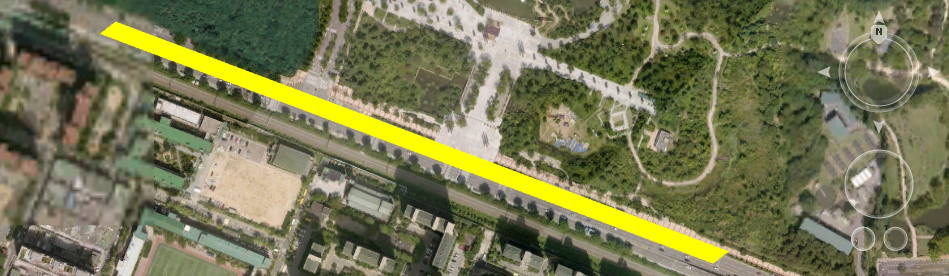
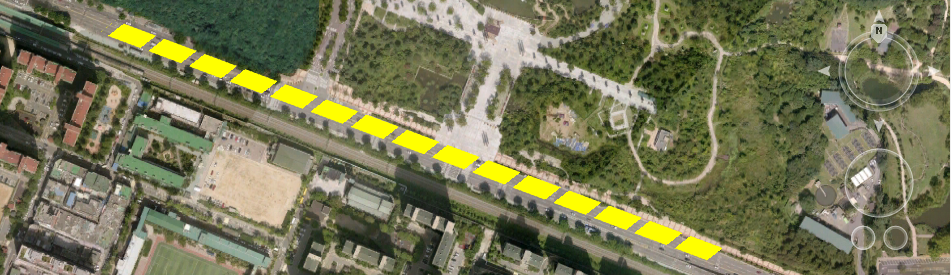
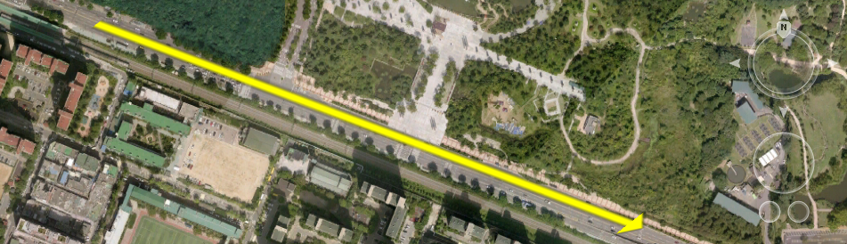
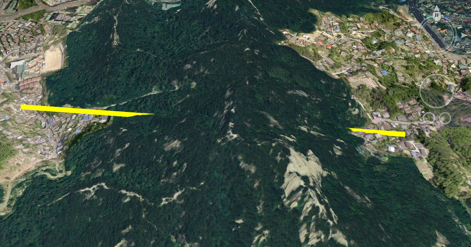
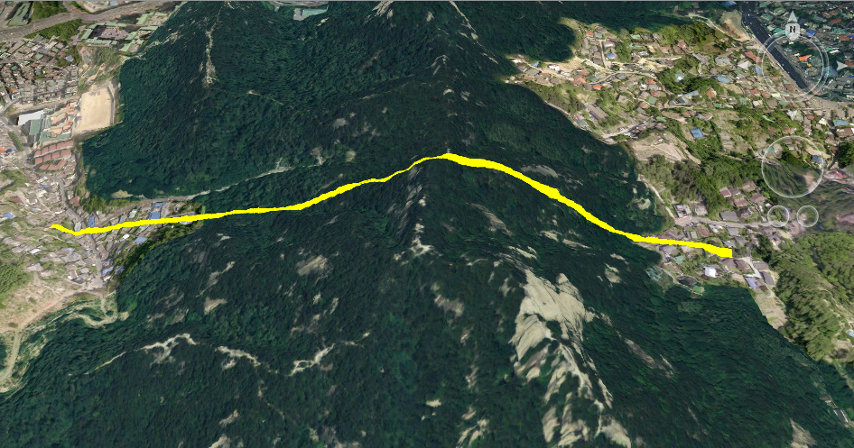
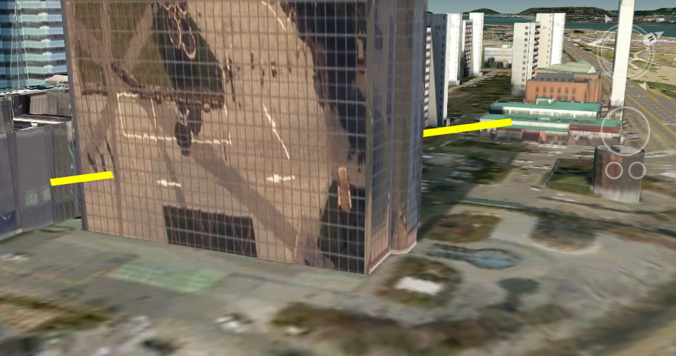
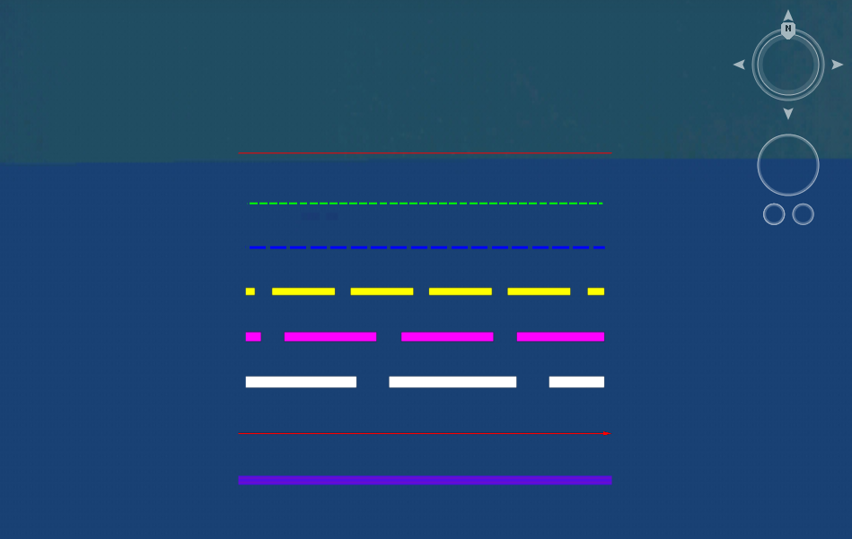

# 라인 생성하기

입력한 좌표를 기반으로 라인 오브젝트를 생성하는 방법에 대해 소개합니다.

## 라인 생성하기

라인 오브젝트는 특정 좌표를 입력받아 [JSLineString](../object/jslinestring.md) 오브젝트를 이용해 생성합니다.

라인은 아래 단계를 거쳐 가시화 할 수 있습니다.

1. 라인 오브젝트 생성
2. 라인 형태 및 속성 지정
3. 레이어 생성 후 라인 저장

아래는 라인 오브젝트를 생성하는 전체 코드입니다.

```javascript
function createLine(_id, _coordinate, _type) {

    // 1. 라인 오브젝트 생성
    var line = Module.createLineString("MY_LINE");

    // 2. 라인 형태 및 속성 지정
    line.createbyJson({
        coordinates: [
            coordinate : [
                [126.0, 37.0, 20],
                [126.002, 37.0, 20]
            ],
            style: "XYZ",
        ],
        type: 0, 	
        union: false, 
        depth: true, 
        color: new Module.JSColor(255, 255, 0, 0), 
        width: 1 
    });

    // 3. 레이어 생성 후 라인 저장
    let layerList = new Module.JSLayerList(true);
    let layer = layerList.createLayer("LINE_LAYER", Module.ELT_3DLINE);
    layer.addObject(line, 0);
}
```

이어서 코드의 세부 단계에 대해 알아봅니다.

### step 1. 라인 오브젝트 생성

Module을 통해 [JSLineString](../object/jslinestring.md) 타입의 라인 오브젝트를 생성합니다.

```javascript
var polygon = Module.createPolygon("MY_LINE");
```

오브젝트 키 값은 오브젝트를 구분하는 값으로 같은 레이어 내 중복되지 않도록 입력합니다.

### step 2. 라인 형태 및 속성 지정

라인의 형태를 지정하기 위해 좌표 및 속성 정보를 추가합니다.

```javascript
line.createbyJson({
    coordinates: [
        coordinate : [
            [126.0, 37.0, 20],
            [126.002, 37.0, 20]
        ],
        style: "XYZ",
    ],
    type: 0, 	
    union: false, 
    depth: true, 
    color: new Module.JSColor(255, 255, 0, 0), 
    width: 1 
});
```

#### coordinates

라인을 구성하는 좌표 리스트입니다. 라인 지점들의 경도, 위도, 고도 값을 입력합니다.

#### type

라인의 형태를 설정합니다. 실선, 점선, 화살표 등 여러 라인 타입을 설정할 수 있습니다.

|            실선 (type : 0)           |            점선 (type : 3)           |           화살표 (type : 4)           |
| :--------------------------------: | :--------------------------------: | :--------------------------------: |
|  |  |  |

#### union

지형 결합 여부를 판별합니다.

false로 설정 된 경우 일반 라인으로 그려지며 true로 설정 된 경우 지형에 RTT 방식으로 그려집니다.


RTT(Render To Texture) 방식을 선택한다면 라인은 지형 텍스쳐 위에 그려지게 되므로 라인이 지형의 굴곡을 따라 표시되나, 이미지 기반으로 렌더링 하므로 라인 경계에 계단 현상이 두드러질 수 있습니다.


|            union = false           |            union = true            |
| :--------------------------------: | :--------------------------------: |
|  |  |

#### depth

라인 오브젝트가 거리(Depth)에 따른 순서로 렌더링 될 지 여부를 설정합니다. true로 설정하는 경우 일반적인 거리 개념과 같이 멀리 있는 라인은 가까운 오브젝트에 가려집니다.



false로 설정하는 경우 가려짐과 상관 없이 레이어 순서에 따라 오브젝트가 그려집니다.

.png>)

#### color

[JSColor](../core/jscolor.md) 값으로 라인 색상을 설정합니다.

#### width

라인의 두께를 설정합니다.

### step 3. 레이어 생성 후 라인 저장

설정을 마친 라인 오브젝트를 레이어에 저장합니다.

```javascript
let layerList = new Module.JSLayerList(true);
let layer = layerList.createLayer("LINE_LAYER", Module.ELT_3DLINE);
layer.addObject(line, 0);
```

## 라인 생성 결과

위 과정을 거쳐 여러 타입의 라인을 한 레이어에 추가하면 아래와 같이 출력됩니다.



라인 생성 과정에 대한 라이브 코드를 확인해 보고 싶으시다면? [여기](http://sandbox.dtwincloud.com/code/main.do?id=object\_line\_Json)를 클릭해 주세요
