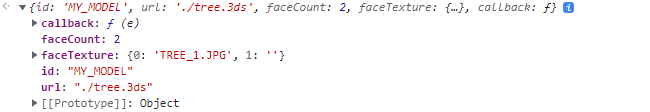

# POI 생성하기

POI(Point of Interest)는 지도에 특정 지점을 표시하는데 주로 사용되며 거리와 상관없이 오브젝트가 일정한 크기를 유지합니다.

XDWorld의 POI는 상단에 이미지, 하단에 텍스트를 출력하는 형식으로 이루어져 있습니다.



## POI 생성하기

POI는 특정 이미지를 활용해 생성하거나 이미지 없이 텍스트로만 생성할 수도 있고 이미지, 텍스트 모두 사용하는 것도 가능합니다.

POI는 [JSPoint](../object/jspoint.md) 타입 오브젝트로 생성됩니다. POI는 아래 과정을 거쳐 가시화 할 수 있습니다.

1. POI를 저장할 레이어 생성
2. POI에 사용할 이미지 로드 및 생성 (이미지를 사용하지 않는 경우 이 단계를 건너뜁니다.)
3. POI 오브젝트 JSPoint 생성
4. POI 속성 설정
5. 레이어에 POI 저장 후 가시화

아래는 POI 이미지와 텍스트가 있는 POI 오브젝트를 생성하는 전체 코드입니다.

이어서 코드의 세부 단계에 대해 알아봅니다.

```javascript
function createPOI() {
	
    // 1. POI 오브젝트를 추가 할 레이어 생성
    var layerList = new Module.JSLayerList(true);
    var layer = layerList.createLayer("POI_LAYER", Module.ELT_3DPOINT);
	
    // 2-1. POI에 사용할 이미지 로드
    var img = new Image();
    img.onload = function() {

        // 2-2. POI에 사용할 이미지 생성
        var canvas = document.createElement('canvas');
        var ctx = canvas.getContext('2d');
        canvas.width = this.width;
        canvas.height = this.height;
        ctx.drawImage(img, 0, 0);
		
        // 3. POI 오브젝트 JSPoint 생성
        var poi = Module.createPoint("MY_POI");

        // 4. POI 속성 설정
        poi.setPosition(new Module.JSVector3D(126.924116, 37.521620, 13.315417));
        poi.setImage(ctx.getImageData(0, 0, this.width, this.height).data, this.width, this.height);
        poi.setText("TEXT");

        // 5. POI 속성 설정
        layer.addObject(poi, 0);
    };
    img.src = "./MY_POI_IMAGE.png";
}
```

### step 1. POI를 저장할 레이어 생성

POI 오브젝트는 가시화를 위해 특정 레이어에 저장되어야 합니다.

레이어에 대한 자세한 설명은 [여기](tutorial\_layer.md)를 참조해 주십시오.

먼저 오브젝트를 저장할 레이어를 생성합니다. 레이어 타입은 ELT\_3DPOINT로 지정합니다.

```javascript
// POI 오브젝트를 추가 할 레이어 생성
var layerList = new Module.JSLayerList(true);
var layer = layerList.createLayer("POI_LAYER", Module.ELT_3DPOINT);
```

생성한 레이어는 이후 JSPoint 생성이 완료되면 다시 사용됩니다.

### step 2. POI에 사용할 이미지 로드 및 생성


이미지를 사용하지 않는 경우 이 단계를 건너뜁니다.


POI에 사용할 이미지를 생성하는 단계입니다.

이미지는 canvas를 통해 생성합니다.

기존 이미지 파일을 canvas 내 그리거나, canvas 컨텍스트로 직접 그려 생성할 수 있습니다.

사용할 이미지를 canvas에 그린 후 getImageData 함수로 이미지 데이터를 반환하고 생성한 이미지를 POI에 적용합니다.

```javascript
var img = new Image();
img.onload = function() {

    // 2-2. POI에 사용할 이미지 생성
    var canvas = document.createElement('canvas');
    var ctx = canvas.getContext('2d');
    canvas.width = this.width;
    canvas.height = this.height;
    ctx.drawImage(img, 0, 0);
	
    // ... (중략) ...

    poi.setImage(ctx.getImageData(0, 0, this.width, this.height).data, this.width, this.height); // 이미지 적용
};
```

이미지 파일을 사용할 필요 없이 canvas에 직접 그린 이미지를 사용할 수도 있습니다.

이 경우 비동기로 이미지 파일을 로드 될 때까지 기다릴 필요가 없으므로 단순한 마커를 표시하려면 아래와 같이 이미지를 생성할 수도 있습니다.

```javascript
var canvas = document.createElement('canvas');

var ctx = canvas.getContext('2d');
ctx.beginPath();
ctx.lineWidth = 6;
ctx.arc(width*0.5, height*0.5, 2, 0, 2*Math.PI, false);
ctx.closePath();

// ... (중략) ...

poi.setImage(ctx.getImageData(0, 0, this.width, this.height).data, this.width, this.height); // 이미지 적용
```


POI 오브젝트는 동일한 이미지를 사용하는 경우가 많습니다.

이 경우 같은 이미지 데이터를 여러번 만드는 것 보다 단 한번만 만든 후 여러 POI에 적용하는 것이 효율적입니다.


### step 3. POI 오브젝트 JSPoint 생성

Module을 통해 JSPoint(링크) 타입의 POI 오브젝트를 생성합니다.

```javascript
var poi = Module.createPoint("MY_POI");
```

생성 시 파라미터로 오브젝트의 키 값을 지정합니다.

오브젝트 키 값은 오브젝트를 구분하는 값으로 같은 레이어 내 동일한 오브젝트 키는 입력할 수 없습니다.

### step 4. POI 속성 설정

POI에 세부 속성을 설정합니다.

```javascript
poi.setPosition(new Module.JSVector3D(126.924116, 37.521620, 13.315417));
poi.setImage(ctx.getImageData(0, 0, this.width, this.height).data, this.width, this.height);
poi.setText("TEXT");
```

POI가 지정한 위치에 가시화 되기 위해서는 위치 값이 필수로 입력되어야 합니다.

또한 이미지를 사용하는 경우 전 단계에서 생성한 이미지 데이터를 등록해주며, 출력할 텍스트 문자열이 있는 경우 함께 지정합니다.

### step 5. 레이어에 POI 저장 후 가시화

생성한 JSPoint 객체는 가시화를 위해 전 단계에서 생성한 레이어에 저장합니다.

```javascript
layer.addObject(poi, 0);
```

## POI 생성 결과

위 단계를 모두 거치면 특정 위치를 표현할 수 있는 POI가 생성됩니다.

아래 이미지는 텍스트를 사용한 POI, 이미지를 사용한 POI, 텍스트와 이미지를 모두 사용한 POI를 렌더링 한 이미지 입니다.

.png>)

이제 POI 오브젝트를 활용하여 표시하고 싶은 위치를 자유롭게 표현할 수 있습니다.

POI 생성 과정에 대한 라이브 코드를 확인해 보고 싶으시다면? [여기](http://sandbox.dtwincloud.com/code/main.do?id=object\_point)를 클릭해 주세요
