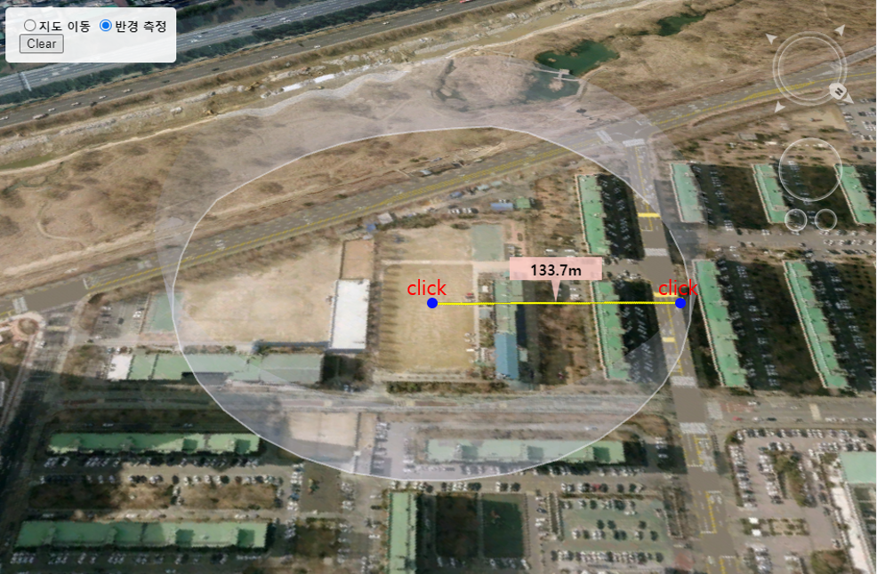

# 반경 측정하기

마우스 모드를 반경측정 모드로 변경한 후 클릭지점 반경을 측정합니다. 첫번째 클릭지점은 중점이되고 두번째 클릭지점까지 거리를 구하여 반지름을 형성합니다. 마우스 클릭으로 구한 반지름으로 반경을 구성하여 랜더링합니다.



## step 1. 레이어 생성

반경측정 Icon 및 반경을 가시화할 레이어를 생성합니다.

```
var layerList = new Module.JSLayerList(true);

POILayer = layerList.createLayer("MEASURE_POI", Module.ELT_3DPOINT);
POILayer.setMaxDistance(20000.0);
POILayer.setSelectable(false);

WallLayer = layerList.createLayer("MEASURE_WALL", Module.ELT_POLYHEDRON);
WallLayer.setMaxDistance(20000.0);
WallLayer.setSelectable(false);
WallLayer.setEditable(true);
```

## step 2. 이벤트 등록

엔진 내부에서 계산된 반경을 반환받기 위해 이벤트를 등록합니다.

```
function initEvent(canvas) {

	// 반경 이벤트 설정
	canvas.addEventListener("Fire_EventAddRadius", function(e){		
		if(e.dTotalDistance > 0) {
		
			// 반경 POI 오브젝트 생성
			createPOI( new Module.JSVector3D(e.dMidLon, e.dMidLat, e.dMidAlt), "rgba(255, 204, 198, 0.8)", e.dTotalDistance );
		}
	});
}
```

## step 3. 마우스모드 변경

반경측정을 위해서 마우스 모드를 변경합니다.

마우스 모드에 대한 설명은 [여기](../etc/type-list.md)를 참조해 주십시오.

```javascript
Module.XDSetMouseState(Module.MML_ANALYS_AREA_CIRCLE);
```

## step 4. 반경 Icon 생성

반환 받은 반경값을 랜더링하기 위해 Icon을 생성합니다.

```
/* 반경측정 Icon 생성 */
function drawIcon(_canvas, _color, _value) {

	// 컨텍스트 반환 및 배경 초기화
	var ctx = _canvas.getContext('2d'),
		width = _canvas.width,
		height = _canvas.height
		;
	ctx.clearRect(0, 0, width, height);

	// 배경 Draw Path 설정 후 텍스트 그리기
	drawBalloon(ctx, height*0.5, width, height, 5, height*0.25, _color);
	setText(ctx, width*0.5, height*0.2, _value);
	

	return ctx.getImageData(0, 0, _canvas.width, _canvas.height).data;
}

/* 말풍선 배경 그리기 */
function drawBalloon(ctx,
					 marginBottom, width, height,
					 barWidth, barHeight,
					 color) {

	var wCenter = width * 0.5,
		hCenter = height * 0.5;

	// 말풍선 형태의 Draw Path 설정
	ctx.beginPath();
	ctx.moveTo(0, 				 0);
	ctx.lineTo(0, 				 height-barHeight-marginBottom);
	ctx.lineTo(wCenter-barWidth, height-barHeight-marginBottom);
	ctx.lineTo(wCenter, 		 height-marginBottom);
	ctx.lineTo(wCenter+barWidth, height-barHeight-marginBottom);
	ctx.lineTo(width,			 height-barHeight-marginBottom);
	ctx.lineTo(width,			 0);
	ctx.closePath();

	// 말풍선 그리기
	ctx.fillStyle = color;
    ctx.fill();
}

/* 텍스트 그리기 */
function setText(_ctx, _posX, _posY, _value) {

	var strText = "";

	// 텍스트 문자열 설정
	if (typeof _value == 'number') {
		strText = setKilloUnit(_value, 0.001, 0);
	} else {
		strText = _value;
	}

	// 텍스트 스타일 설정
	_ctx.font = "bold 16px sans-serif";
    _ctx.textAlign = "center";
	_ctx.fillStyle = "rgb(0, 0, 0)";

	// 텍스트 그리기
    _ctx.fillText(strText, _posX, _posY);
}

/* m/km 텍스트 변환 */
function setKilloUnit(_text, _meterToKilloRate, _decimalSize){

	if (_decimalSize < 0){
		_decimalSize = 0;
	}
	if (typeof _text == "number") {
		if (_text < 1.0/(_meterToKilloRate*Math.pow(10,_decimalSize))) {
			_text = _text.toFixed(1).toString()+'m';
		} else {
			_text = (_text*_meterToKilloRate).toFixed(2).toString()+'㎞';
		}
	}
	return _text;
}
```

## step 5. 반경 객체 생성

생성한 Icon으로 객체를 만들고 레이어에 추가합니다.

```
function createPOI(_position, _color, _value) {

	// POI 아이콘 이미지를 그릴 Canvas 생성
	var drawCanvas = document.createElement('canvas');
    drawCanvas.width = 100;
    drawCanvas.height = 100;

	// 아이콘 이미지 데이터 반환
	var imageData = drawIcon(drawCanvas, _color, _value);

	// 심볼에 아이콘 이미지 등록
	if (Symbol.insertIcon("Icon", imageData, drawCanvas.width, drawCanvas.height)) {

		// 등록한 아이콘 객체 반환
		var icon = Symbol.getIcon("Icon");

		// JSPoint 객체 생성
		var poi = Module.createPoint("POI");

		poi.setPosition(_position);		// 위치 설정
		poi.setIcon(icon);				// 아이콘 설정

		// 레이어에 오브젝트 추가
		POILayer.addObject(poi, 0);
	}
}
```

